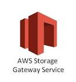

# Connect Kafka to AWS Storage Gateway

Quix helps you integrate Apache Kafka with AWS Storage Gateway using pure Python.

Transform and pre-process data, with the new alternative to Confluent Kafka Connect, before loading it into a specific format, simplifying data lake house architecture, reducing storage and ownership costs and enabling data teams to achieve success for your business.

## AWS Storage Gateway

The AWS Storage Gateway is a hybrid cloud storage service that seamlessly extends on-premises storage solutions to the cloud. It allows users to securely store data in the AWS cloud while maintaining an on-premises data center for quick access. By providing a virtual on-premises gateway, AWS Storage Gateway enables organizations to easily integrate cloud storage into their existing infrastructure without the need for complex and costly migrations. This innovative technology ensures reliable and scalable storage solutions for businesses of all sizes, offering flexible storage options and low-latency access to data.

## Integrations

- __Find out how we can help you integrate!__

    <a class="md-button md-button--primary" href="https://share.hsforms.com/1iW0TmZzKQMChk0lxd_tGiw4yjw2?__hstc=175542013.2303933fbd746c0ac86d9ccbe9bc9100.1728383268831.1729603416735.1729620918855.31&__hssc=175542013.1.1729620918855&__hsfp=2132701734" target="_blank" style="margin:.5rem;">Book a demo</a>

Quix is a powerful tool for integrating with AWS Storage Gateway due to its ability to pre-process and transform data from various sources before loading it into a specific data format. This capability simplifies lakehouse architecture and provides customizable connectors for different destinations, making it a seamless fit for integrating with AWS Storage Gateway.

Furthermore, Quix Streams, an open-source Python library, facilitates data transformation using streaming DataFrames. This feature supports operations such as aggregation, filtering, and merging during the transformation process, enhancing the efficiency and flexibility of data handling.

Moreover, Quix ensures efficient data handling from source to destination with no throughput limits, automatic backpressure management, and checkpointing. This streamlined approach to data management enhances the integration process and ensures data integrity throughout.

Additionally, Quix supports sinking transformed data to cloud storage in a specific format, ensuring seamless integration and storage efficiency at the destination. This capability makes it ideal for integrating with AWS Storage Gateway and leveraging cloud storage for data storage and processing.

Overall, Quix provides a cost-effective solution for managing data from source through transformation to destination, offering a lower total cost of ownership compared to other alternatives. By leveraging Quix's capabilities, users can optimize their data integration process and enhance their overall data management operations.

