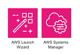

# Connect Kafka to AWS Systems Manager

Quix helps you integrate Apache Kafka with AWS Systems Manager using pure Python.

Transform and pre-process data, with the new alternative to Confluent Kafka Connect, before loading it into a specific format, simplifying data lake house arthitectures, reducing storage and ownership costs and enabling data teams to achieve success for your business.

## AWS Systems Manager

AWS Systems Manager is a robust, comprehensive management service that allows users to automate tasks and control configurations across a wide range of AWS services. It simplifies operational tasks, such as patch management, system inventory, and software installations, making it easier for users to maintain consistent and secure environments at scale. With AWS Systems Manager, users can manage and configure their infrastructure in a centralized and efficient manner, ensuring optimal performance and security across their AWS resources.

## Integrations

- __Find out how we can help you integrate!__

    <a class="md-button md-button--primary" href="https://share.hsforms.com/1iW0TmZzKQMChk0lxd_tGiw4yjw2?__hstc=175542013.2303933fbd746c0ac86d9ccbe9bc9100.1728383268831.1729603416735.1729620918855.31&__hssc=175542013.1.1729620918855&__hsfp=2132701734" target="_blank" style="margin:.5rem;">Book a demo</a>

Quix is a highly compatible solution for integrating with AWS Systems Manager due to its versatile data processing capabilities. By allowing data engineers to preprocess and transform data from different sources before loading it into specific formats, Quix simplifies the architecture of lakehouses and facilitates seamless integration with AWS Systems Manager. The platform's customizable connectors for various destinations ensure flexibility in data handling, while Quix Streams, an open-source Python library, enables efficient data transformation using streaming DataFrames. Additionally, Quix's support for sinking transformed data to cloud storage in a specified format enhances storage efficiency at the destination, making it a reliable choice for AWS Systems Manager integration. The platform's cost-effective nature further contributes to its appeal, offering a budget-friendly solution for managing data from source to destination.

