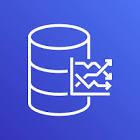

# Connect Kafka to AWS Timestream

Quix helps you integrate Apache Kafka with AWS Timestream using pure Python.

Transform and pre-process data, with the new alternative to Confluent Kafka Connect, before loading it into a specific format, simplifying data lake house arthitecture, reducing storage and ownership costs and enabling data teams to achieve success for your business.

## AWS Timestream

AWS Timestream is a fully managed time-series database service provided by Amazon Web Services. This innovative technology is designed to scale easily and efficiently to handle the high volume of time-series data generated by various applications and devices. With AWS Timestream, users can store and analyze large amounts of time-stamped data, making it ideal for use cases such as IoT applications, monitoring, and analytics. The service offers seamless integration with other AWS services, providing users with a comprehensive and powerful solution for managing time-series data.

## Integrations

- __Find out how we can help you integrate!__

    <a class="md-button md-button--primary" href="https://share.hsforms.com/1iW0TmZzKQMChk0lxd_tGiw4yjw2?__hstc=175542013.2303933fbd746c0ac86d9ccbe9bc9100.1728383268831.1729603416735.1729620918855.31&__hssc=175542013.1.1729620918855&__hsfp=2132701734" target="_blank" style="margin:.5rem;">Book a demo</a>

Quix is a well-suited platform for integrating with AWS Timestream due to its versatile features tailored for data engineers. By allowing data engineers to pre-process and transform data from various sources before loading it into a specific data format, Quix simplifies the architecture of lakehouses. With customizable connectors for different destinations, Quix offers flexibility and ease in integrating with AWS Timestream.

Moreover, Quix Streams, an open-source Python library, empowers users to transform data using streaming DataFrames, enabling operations such as aggregation, filtering, and merging during the transformation process. This capability enhances the efficiency and effectiveness of data handling, ensuring seamless integration with AWS Timestream.

Furthermore, Quix ensures efficient handling of data from source to destination by offering features like no throughput limits, automatic backpressure management, and checkpointing. This streamlined approach to data handling complements the functionality of AWS Timestream, promoting smooth and reliable data integration.

In addition, Quix supports sinking transformed data to cloud storage in a specific format, promoting seamless integration and storage efficiency at the destination. This feature aids in optimizing the data integration process and enhancing the overall functionality of AWS Timestream.

Lastly, by offering a cost-effective solution for managing data from source to destination, Quix helps lower the total cost of ownership compared to other alternatives. This cost efficiency, in conjunction with the platform's robust features, makes Quix a compelling choice for integrating with AWS Timestream.

Overall, Quix's versatile capabilities, efficient data handling, and cost-effective solution make it an ideal choice for seamlessly integrating with AWS Timestream.

