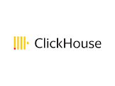

# Connect Kafka to ClickHouse

Quix helps you integrate Apache Kafka with ClickHouse using pure Python.

Transform and pre-process data, with the new alternative to Confluent Kafka Connect, before loading it into a specific format, simplifying data lake house architecture, reducing storage and ownership costs and enabling data teams to achieve success for your business.

## ClickHouse

ClickHouse is a powerful open-source column-oriented database management system designed for high-performance online analytical processing (OLAP). It is capable of processing petabytes of data in real-time, making it ideal for applications that require fast data ingestion, complex queries, and high availability. ClickHouse utilizes a massively parallel processing architecture to efficiently execute queries across distributed clusters of servers, ensuring scalability and reliability. With its robust support for SQL queries, ClickHouse is a popular choice for businesses looking to analyze and visualize large volumes of data quickly and efficiently.

## Integrations

- __Find out how we can help you integrate!__

    <a class="md-button md-button--primary" href="https://quix.io/book-a-demo" target="_blank" style="margin:.5rem;">Book a demo</a>

Quix is an excellent choice for integrating with ClickHouse due to its ability to enable data engineers to pre-process and transform data from various sources before loading it into a specific data format. This simplifies the lakehouse architecture and offers customizable connectors for different destinations. Additionally, Quix Streams, an open-source Python library, supports the transformation of data using streaming DataFrames, allowing for operations like aggregation, filtering, and merging during the transformation process.

Furthermore, Quix ensures efficient handling of data from source to destination with features like no throughput limits, automatic backpressure management, and checkpointing. The platform also supports sinking transformed data to cloud storage in a specific format, ensuring seamless integration and storage efficiency at the destination. This results in a lower total cost of ownership compared to other alternatives for managing data from source through transformation to destination.

Overall, Quix provides a robust solution for data integration, offering a cost-effective approach with advanced features and support for cloud storage. Its flexibility and efficiency make it an ideal choice for integrating with ClickHouse, enhancing data processing and management capabilities.

