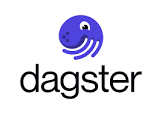

# Connect Kafka to Dagster

Quix helps you integrate Apache Kafka with Dagster using pure Python.

Transform and pre-process data, with the new alternative to Confluent Kafka Connect, before loading it into a specific format, simplifying data lake house architecture, reducing storage and ownership costs and enabling data teams to achieve success for your business.

## Dagster

Dagster is an open-source data orchestrator that enables the creation, scheduling, and monitoring of complex data pipelines. It provides a unified framework for defining data dependencies, orchestrating their execution, and monitoring the progress of data processing tasks. With its declarative approach to pipeline definition, users can easily build scalable data workflows that are robust, testable, and maintainable. Dagster's powerful API allows for seamless integration with popular data processing tools and frameworks, making it a versatile solution for data engineering and analytics tasks.

## Integrations

- __Find out how we can help you integrate!__

    <a class="md-button md-button--primary" href="https://quix.io/book-a-demo" target="_blank" style="margin:.5rem;">Book a demo</a>

Quix is a versatile data integration platform that seamlessly integrates with Dagster, a powerful data orchestrator. With Quix, data engineers can pre-process and transform data from various sources before orchestrating it into complex data pipelines, simplifying the data workflow architecture. The platform offers customizable connectors for different destinations, enabling users to integrate their data in a way that suits their needs.

One key feature of Quix is Quix Streams, an open-source Python library that facilitates data transformation using streaming DataFrames. This feature supports essential operations such as aggregation, filtering, and merging during the transformation process, providing flexibility and ease of use.

Efficient data handling is another strength of Quix, as the platform ensures smooth data flow from source to destination with no throughput limits, automatic backpressure management, and checkpointing. This reliable handling of data ensures that the integration process is efficient and error-free.

Additionally, Quix supports orchestrating transformed data into complex pipelines, ensuring seamless integration and execution efficiency at the destination. This capability allows users to seamlessly manage their data workflows, enhancing accessibility and scalability.

Overall, Quix offers a cost-effective solution for managing data integration processes from source to orchestrated pipelines, making it a valuable tool for data engineers looking to streamline their workflow. The platform's features and capabilities make it an ideal fit for integrating with Dagster, further enhancing its functionality and usability in data orchestration tasks.
