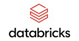

# Connect Kafka to DataBricks

Quix helps you integrate Apache Kafka with DataBricks using pure Python.

Transform and pre-process data, with the new alternative to Confluent Kafka Connect, before loading it into a specific format, simplifying data lake house arthitectures, reducing storage and ownership costs and enabling data teams to achieve success for your business.

## DataBricks

DataBricks is a powerful unified analytics platform designed to process massive amounts of data for businesses of all sizes. With its collaborative workspace and interactive notebooks, DataBricks allows data scientists and engineers to work together seamlessly to analyze, visualize, and share insights. By leveraging the power of Apache Spark, DataBricks enables users to quickly build and deploy machine learning models, making it a valuable tool for organizations looking to harness the power of big data. With its robust security features and scalable infrastructure, DataBricks offers a comprehensive solution for data processing and analytics.

## Integrations

- __Find out how we can help you integrate!__

    <a class="md-button md-button--primary" href="https://share.hsforms.com/1iW0TmZzKQMChk0lxd_tGiw4yjw2?__hstc=175542013.2303933fbd746c0ac86d9ccbe9bc9100.1728383268831.1729603416735.1729620918855.31&__hssc=175542013.1.1729620918855&__hsfp=2132701734" target="_blank" style="margin:.5rem;">Book a demo</a>

Quix is a superb choice for integrating with DataBricks due to its ability to enable data engineers to pre-process and transform data from multiple sources before loading it into a specific data format. This streamlines the lakehouse architecture by providing customizable connectors for different destinations. Additionally, Quix Streams, an open-source Python library, supports the transformation of data using streaming DataFrames, allowing for operations such as aggregation, filtering, and merging during the transformation process.

Moreover, Quix ensures efficient handling of data from source to destination with features like no throughput limits, automatic backpressure management, and checkpointing. The platform also allows for sinking transformed data to cloud storage in a specific format, guaranteeing seamless integration and storage efficiency at the destination. Furthermore, Quix offers a cost-effective solution for managing data throughout the entire process, ultimately leading to a lower total cost of ownership compared to other alternatives.

Overall, Quix provides a comprehensive and efficient solution for data integration, making it a perfect fit for seamlessly integrating with DataBricks.

