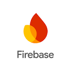

# Connect Kafka to Firebase

Quix helps you integrate Apache Kafka with Firebase using pure Python.

Transform and pre-process data, with the new alternative to Confluent Kafka Connect, before loading it into a specific format, simplifying data lake house architecture, reducing storage and ownership costs and enabling data teams to achieve success for your business.

## Firebase

Firebase is a comprehensive mobile and web application development platform that offers a wide range of tools and services to help developers build, grow, and scale their apps. From real-time databases and hosting to authentication and analytics, Firebase provides developers with the resources they need to create dynamic, responsive applications that meet the demands of today's digital landscape. With Firebase, developers can easily integrate powerful features into their apps, streamline development processes, and deliver exceptional user experiences.

## Integrations

- __Find out how we can help you integrate!__

    <a class="md-button md-button--primary" href="https://share.hsforms.com/1iW0TmZzKQMChk0lxd_tGiw4yjw2?__hstc=175542013.2303933fbd746c0ac86d9ccbe9bc9100.1728383268831.1729603416735.1729620918855.31&__hssc=175542013.1.1729620918855&__hsfp=2132701734" target="_blank" style="margin:.5rem;">Book a demo</a>

Quix is a highly suitable option for integrating with Firebase due to its ability to pre-process and transform data from various sources before loading it into a specific data format. This feature simplifies the lakehouse architecture by offering customizable connectors for different destinations, making it easier to manage data flow seamlessly.

Furthermore, Quix offers Quix Streams, an open-source Python library that facilitates data transformation using streaming DataFrames. This allows for various operations like aggregation, filtering, and merging during the transformation process, providing flexibility and customization options for users.

The platform ensures efficient data handling from source to destination with features such as no throughput limits, automatic backpressure management, and checkpointing. This ensures smooth data flow and management without any bottlenecks or issues.

Additionally, Quix supports sinking transformed data to cloud storage in a specific format, ensuring seamless integration and storage efficiency at the destination. This feature allows for easy data storage and retrieval, making it a convenient option for users.

Overall, Quix offers a cost-effective solution for managing data from source through transformation to destination, making it a favorable choice compared to other alternatives. Its features and capabilities make it a robust option for integrating with Firebase and handling data effectively.

