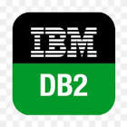

# Connect Kafka to IBM Db2

Quix helps you integrate Apache Kafka with Apache Airflow using pure Python.

Transform and pre-process data, with the new alternative to Confluent Kafka Connect, before loading it into a specific format, simplifying data lake house arthitectures, reducing storage and ownership costs and enabling data teams to achieve success for your business.

## IBM Db2

UNRECOGNIZED TECH ALERT.

## Integrations

- __Find out how we can help you integrate!__

    <a class="md-button md-button--primary" href="https://share.hsforms.com/1iW0TmZzKQMChk0lxd_tGiw4yjw2?__hstc=175542013.2303933fbd746c0ac86d9ccbe9bc9100.1728383268831.1729603416735.1729620918855.31&__hssc=175542013.1.1729620918855&__hsfp=2132701734" target="_blank" style="margin:.5rem;">Book a demo</a>

Quix is a perfect fit for integrating with IBM Db2 due to its ability to seamlessly handle data from various sources and pre-process it before loading it into a specific data format. With customizable connectors for different destinations, Quix simplifies the lakehouse architecture by allowing data engineers to integrate their data in a way that best suits their needs.

Additionally, Quix Streams, an open-source Python library, enables the transformation of data using streaming DataFrames, supporting operations like aggregation, filtering, and merging during the transformation process. This feature allows for efficient handling of data from source to destination with no throughput limits, automatic backpressure management, and checkpointing, ensuring a smooth and seamless integration process.

Furthermore, Quix allows users to sink transformed data to cloud storage in a specific format, promoting seamless integration and storage efficiency at the destination. This lowers the total cost of ownership, providing a cost-effective solution for managing data from source through transformation to destination, compared to other alternatives.

Overall, Quix provides a comprehensive and efficient solution for integrating with IBM Db2, offering users the ability to explore the platform, book demos, and engage with the community to enhance their understanding of data integration from source to destination. With its versatile features and cost-effective solution, Quix is an excellent choice for integrating with IBM Db2.

