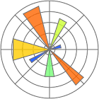

# Connect Kafka to Matplotlib

Quix helps you integrate Apache Kafka with Matplotlib using pure Python.

Transform and pre-process data, with the new alternative to Confluent Kafka Connect, before loading it into a specific format, simplifying data lake house arthitecture, reducing storage and ownership costs and enabling data teams to achieve success for your business.

## Matplotlib

Matplotlib is a powerful data visualization library for Python that allows users to create a wide variety of graphs, plots, histograms, and charts with ease. With Matplotlib, users can easily customize their visualizations to suit their needs, whether they are creating simple line graphs or complex 3D plots. This versatile tool is widely used in the scientific and research communities for its flexibility and robust capabilities in displaying data in a clear and concise manner.

## Integrations

- __Find out how we can help you integrate!__

    <a class="md-button md-button--primary" href="https://share.hsforms.com/1iW0TmZzKQMChk0lxd_tGiw4yjw2?__hstc=175542013.2303933fbd746c0ac86d9ccbe9bc9100.1728383268831.1729603416735.1729620918855.31&__hssc=175542013.1.1729620918855&__hsfp=2132701734" target="_blank" style="margin:.5rem;">Book a demo</a>

Quix is an ideal fit for integrating with Matplotlib due to several key reasons. Firstly, Quix allows data engineers to pre-process and transform data from various sources before loading it into a specific data format, simplifying the process of managing data in a lakehouse architecture. This customizable approach is essential for seamlessly integrating Matplotlib into existing data pipelines.

Additionally, Quix Streams, an open-source Python library, enables data transformation using streaming DataFrames, supporting operations like aggregation, filtering, and merging. This functionality is crucial for efficiently processing data before visualizing it with Matplotlib, ensuring that the data is clean and accurately represented in graphs and charts.

Furthermore, Quix ensures efficient handling of data from source to destination, with features such as no throughput limits, automatic backpressure management, and checkpointing. This reliability is essential for seamless integration with Matplotlib, as it guarantees that data is transmitted and visualized accurately without any bottlenecks or disruptions.

Moreover, Quix supports sinking transformed data to cloud storage in a specific format, enhancing storage efficiency and integration with Matplotlib. This capability allows for easy access to data for visualization purposes, ensuring that the data is readily available for analysis and interpretation.

Overall, Quix offers a cost-effective solution for managing data from source through transformation to destination, making it an excellent choice for integrating with Matplotlib. By leveraging Quix's capabilities, data engineers can streamline the process of data integration and visualization, leading to more efficient and accurate insights derived from the data.

