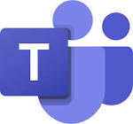

# Connect Kafka to Microsoft Teams

Quix helps you integrate Apache Kafka with Microsoft Teams using pure Python.

Transform and pre-process data, with the new alternative to Confluent Kafka Connect, before loading it into a specific format, simplifying data lake house arthitectures, reducing storage and ownership costs and enabling data teams to achieve success for your business.

## Microsoft Teams

Microsoft Teams is a collaboration platform that combines workplace chat, video meetings, file storage, and application integration. It allows teams to communicate and collaborate in real-time, making it easier to work together regardless of physical location. With features like chat threads, video conferencing, file sharing, and integration with other Microsoft Office applications, Teams streamlines communication and enhances productivity. The platform also provides secure access controls and compliance features, making it a reliable choice for businesses looking to improve collaboration among their teams.

## Integrations

- __Find out how we can help you integrate!__

    <a class="md-button md-button--primary" href="https://share.hsforms.com/1iW0TmZzKQMChk0lxd_tGiw4yjw2?__hstc=175542013.2303933fbd746c0ac86d9ccbe9bc9100.1728383268831.1729603416735.1729620918855.31&__hssc=175542013.1.1729620918855&__hsfp=2132701734" target="_blank" style="margin:.5rem;">Book a demo</a>

The integration of Quix with Microsoft Teams presents a seamless solution for data engineers looking to streamline their data handling processes. With Quix's ability to pre-process and transform data from multiple sources before loading it into a specific format, it simplifies the overall lakehouse architecture by offering customizable connectors for different destinations within Microsoft Teams.

Additionally, Quix Streams, an open-source Python library, allows for efficient data transformation using streaming DataFrames, supporting essential operations like aggregation, filtering, and merging. This capability enhances the flexibility of data handling within Microsoft Teams, enabling data engineers to adapt their processes to meet specific requirements.

Moreover, Quix ensures efficient data handling from source to destination within Microsoft Teams by eliminating throughput limits, managing automatic backpressure, and providing checkpointing functionalities. By supporting the sinking of transformed data to cloud storage in a specific format, Quix further enhances storage efficiency and seamless integration with Microsoft Teams.

Overall, the integration of Quix with Microsoft Teams offers a cost-effective solution for managing data and transforming it from source through to the destination. This comprehensive approach to data integration within Microsoft Teams ensures a lower total cost of ownership compared to other alternatives, making it a suitable choice for data engineers seeking an effective and efficient solution for their data handling needs.

