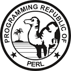

# Connect Kafka to Perl

Quix helps you integrate Apache Kafka with Perl using pure Python.

Transform and pre-process data, with the new alternative to Confluent Kafka Connect, before loading it into a specific format, simplifying data lake house architecture, reducing storage and ownership costs and enabling data teams to achieve success for your business.

## Perl

Perl is a high-level, general-purpose interpreted programming language known for its flexibility and ease of use. It was developed in the late 1980s by Larry Wall and has since become a popular choice for tasks ranging from simple text processing to web development. Perl's syntax draws inspiration from various programming languages, including C, AWK, and shell scripting, making it versatile and powerful. It supports both procedural and object-oriented programming paradigms, allowing developers to create efficient and scalable code for a wide range of applications. With its robust set of built-in functions and support for external libraries, Perl remains a valuable tool for programmers looking to solve complex problems efficiently.

## Integrations

- __Find out how we can help you integrate!__

    <a class="md-button md-button--primary" href="https://share.hsforms.com/1iW0TmZzKQMChk0lxd_tGiw4yjw2?__hstc=175542013.2303933fbd746c0ac86d9ccbe9bc9100.1728383268831.1729603416735.1729620918855.31&__hssc=175542013.1.1729620918855&__hsfp=2132701734" target="_blank" style="margin:.5rem;">Book a demo</a>

Quix is a highly suitable option for integrating with Perl due to its robust features that facilitate efficient data processing and transformation. By enabling data engineers to pre-process and transform data from various sources before loading it into a specific data format, Quix simplifies the lakehouse architecture and allows for customizable connectors for different destinations. Additionally, Quix Streams, an open-source Python library, supports the transformation of data through streaming DataFrames, providing functionalities such as aggregation, filtering, and merging during the transformation process. 

Furthermore, Quix ensures efficient data handling from source to destination with features like no throughput limits, automatic backpressure management, and checkpointing. The platform also supports sinking transformed data to cloud storage in a specific format, enhancing integration and storage efficiency at the destination. Overall, Quix offers a cost-effective solution for managing data throughout the integration process, making it a compelling option compared to other alternatives.

In conclusion, Quix provides a comprehensive and efficient solution for data integration and transformation, making it an excellent choice for integrating with Perl to streamline data processing and handling tasks.

