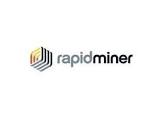

# Connect Kafka to RapidMiner

Quix helps you integrate Apache Kafka with RapidMiner using pure Python.

Transform and pre-process data, with the new alternative to Confluent Kafka Connect, before loading it into a specific format, simplifying data lake house architecture, reducing storage and ownership costs and enabling data teams to achieve success for your business.

## RapidMiner

RapidMiner is a powerful and versatile data science platform that enables users to easily create predictive models and insights from large datasets. With its intuitive interface and wide range of tools, RapidMiner simplifies the process of data analytics, allowing users to quickly extract valuable information and make informed decisions. This technology supports a variety of data sources and formats, making it suitable for a wide range of industries and use cases. Its advanced features, such as automated model generation and optimization, streamline the data analysis process and help users uncover hidden patterns and trends within their data. RapidMiner is a valuable tool for businesses looking to leverage their data for competitive advantage and informed decision-making.

## Integrations

- __Find out how we can help you integrate!__

    <a class="md-button md-button--primary" href="https://quix.io/book-a-demo" target="_blank" style="margin:.5rem;">Book a demo</a>

Quix is an ideal fit for integrating with RapidMiner due to its ability to enable data engineers to pre-process and transform data from various sources before loading it into a specific data format. This simplifies lakehouse architecture by providing customizable connectors for different destinations. Additionally, Quix Streams, an open-source Python library, facilitates the transformation of data using streaming DataFrames, supporting operations like aggregation, filtering, and merging during the transformation process. The platform ensures efficient handling of data from source to destination with no throughput limits, automatic backpressure management, and checkpointing. Quix also supports sinking transformed data to cloud storage in a specific format, ensuring seamless integration and storage efficiency at the destination. Overall, Quix offers a cost-effective solution for managing data from source through transformation to destination, making it a valuable tool for integrating with RapidMiner.

