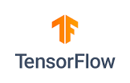

# Connect Kafka to TensorFlow

Quix helps you integrate Apache Kafka with TensorFlow using pure Python.

Transform and pre-process data, with the new alternative to Confluent Kafka Connect, before loading it into a specific format, simplifying data lake house arthitecture, reducing storage and ownership costs and enabling data teams to achieve success for your business.

## TensorFlow

TensorFlow is an open-source machine learning framework developed by Google that allows users to build and train neural networks for various computational tasks. Through its flexible architecture, TensorFlow enables developers to deploy machine learning models across a variety of platforms, from desktops to mobile devices. With its extensive collection of tools and libraries, TensorFlow has become a popular choice for researchers and professionals in the field of artificial intelligence, enabling them to tackle complex problems with ease and efficiency.

## Integrations

- __Find out how we can help you integrate!__

    <a class="md-button md-button--primary" href="https://share.hsforms.com/1iW0TmZzKQMChk0lxd_tGiw4yjw2?__hstc=175542013.2303933fbd746c0ac86d9ccbe9bc9100.1728383268831.1729603416735.1729620918855.31&__hssc=175542013.1.1729620918855&__hsfp=2132701734" target="_blank" style="margin:.5rem;">Book a demo</a>

Quix is a great fit for integrating with TensorFlow due to its ability to enable data engineers to pre-process and transform data from various sources before loading it into a specific data format. This simplifies lakehouse architecture by providing customizable connectors for different destinations. Additionally, Quix Streams, an open-source Python library, facilitates data transformation using streaming DataFrames, supporting operations such as aggregation, filtering, and merging during the transformation process.

Moreover, Quix ensures efficient data handling from source to destination with features like no throughput limits, automatic backpressure management, and checkpointing. The platform also supports sinking transformed data to cloud storage in a specific format, ensuring seamless integration and storage efficiency at the destination. In terms of cost-effectiveness, Quix offers a solution for managing data that is more cost-effective compared to other alternatives.

Overall, integrating Quix with TensorFlow can enhance the data transformation process, streamline data handling, and provide a cost-effective solution for managing data from source to destination.

