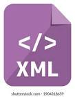

# Connect Kafka to XML Graphics

Quix helps you integrate Apache Kafka with XML Graphics using pure Python.

Transform and pre-process data, with the new alternative to Confluent Kafka Connect, before loading it into a specific format, simplifying data lake house architecture, reducing storage and ownership costs and enabling data teams to achieve success for your business.

## XML Graphics

XML Graphics is a markup language that defines a set of rules for encoding visual data in a format that is both human-readable and machine-understandable. This technology allows users to create and display graphical content, such as images, charts, diagrams, and vector graphics, in a flexible and extensible manner. XML Graphics leverages the power of XML to provide a standardized way of representing graphic information, making it easier for applications to exchange and process visual data. By using XML Graphics, developers can design sophisticated graphics that are scalable, customizable, and accessible across different platforms and devices.

## Integrations

- __Find out how we can help you integrate!__

    <a class="md-button md-button--primary" href="https://share.hsforms.com/1iW0TmZzKQMChk0lxd_tGiw4yjw2?__hstc=175542013.2303933fbd746c0ac86d9ccbe9bc9100.1728383268831.1729603416735.1729620918855.31&__hssc=175542013.1.1729620918855&__hsfp=2132701734" target="_blank" style="margin:.5rem;">Book a demo</a>

Quix is an excellent choice for integrating with XML Graphics due to its ability to enable data engineers to pre-process and transform data from various sources before loading it into a specific data format. This simplifies lakehouse architecture with customizable connectors for different destinations. Additionally, Quix Streams, an open-source Python library, facilitates the transformation of data using streaming DataFrames, supporting operations like aggregation, filtering, and merging during the transformation process. 

Furthermore, Quix ensures efficient handling of data from source to destination with no throughput limits, automatic backpressure management, and checkpointing. The platform also supports sinking transformed data to cloud storage in a specific format, ensuring seamless integration and storage efficiency at the destination. Overall, Quix offers a cost-effective solution for managing data from source through transformation to destination, making it a strong choice for integrating with XML Graphics.

