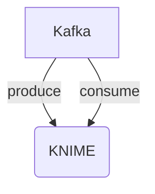

# Connect Kafka to KNIME

Quix helps you integrate Kafka to KNIME using pure Python.

## KNIME

KNIME is an open-source platform for data analytics, reporting, and integration that allows users to visually model their data processes using a drag-and-drop interface. It is designed to be user-friendly and allows users to easily manipulate, analyze, and visualize data without requiring complex programming skills. KNIME offers a wide range of plugins and extensions that extend its functionality, making it a versatile tool for data scientists, analysts, and researchers. It supports a variety of data formats and can be integrated with popular data sources such as databases, Hadoop, and cloud storage services. Overall, KNIME is a powerful and flexible technology that makes data analysis and modeling accessible to users of all skill levels.

## Integrations

Quix is a good fit for integrating with KNIME because it offers a range of features that complement and enhance the capabilities of KNIME in developing, deploying, and managing real-time data pipelines. 

1. Streamlined Development and Deployment: The integrated online code editors and CI/CD tools in Quix Streams simplify the creation and deployment of data pipelines, making it easier for KNIME users to develop and deploy their workflows.

2. Enhanced Collaboration: Quix Cloud supports efficient collaboration with organization and permission management, increasing project visibility and control, which can benefit KNIME users working in team environments.

3. Real-Time Monitoring: With tools for real-time logs, metrics, and data exploration, Quix Cloud allows users to monitor pipeline performance and critical metrics in real-time, providing valuable insights for KNIME users.

4. Flexible Scaling and Management: Quix Cloud makes it easy to scale resources, manage CPU and memory, and handle multiple environments linked to Git branches, providing flexibility and scalability that can be useful for KNIME users dealing with large and complex datasets.

5. Security and Compliance: Quix Cloud ensures secure management of secrets and compliance with dedicated infrastructure options and SLAs, providing a secure environment for KNIME users to work in.

6. Development Tools: Quix Cloud includes online code editors, code templates, and connectors for various data sources and sinks, supporting DevContainers for enhanced workflows, which can improve the development process for KNIME users.

7. Data Exploration and Visualization: Users can query and explore data using waveform and table views, and visualize messages and metrics in real-time, providing valuable insights for KNIME users analyzing and visualizing data.

Overall, the features and capabilities of Quix align well with the needs of KNIME users looking to enhance their data processing and analytics workflows, making it a good fit for integration with KNIME.

