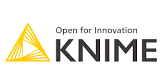

# Connect Kafka to KNIME

Quix helps you integrate Kafka to KNIME using pure Python.

- __Find out how we can help you integrate!__

    <a class="md-button md-button--primary" href="https://share.hsforms.com/1iW0TmZzKQMChk0lxd_tGiw4yjw2?__hstc=175542013.2303933fbd746c0ac86d9ccbe9bc9100.1728383268831.1729603416735.1729620918855.31&__hssc=175542013.1.1729620918855&__hsfp=2132701734" target="_blank" style="margin:.5rem;">Book a demo</a>

## KNIME

KNIME, short for Konstanz Information Miner, is an open-source data analytics platform that allows users to manipulate, analyze, and visualize data through a graphical user interface. KNIME is designed for users with varying levels of technical expertise, making it accessible to both beginners and experienced data scientists. With a wide range of built-in tools and extensions, users can perform tasks such as data preprocessing, machine learning, and reporting without the need for programming knowledge. KNIME also supports integration with other tools and languages, allowing for seamless collaboration and flexibility in data analysis workflows. Whether it be for academic research, industrial projects, or business intelligence, KNIME provides a powerful and user-friendly solution for data analytics.

## Integrations

Quix is a good fit for integrating with KNIME because of its comprehensive platform designed to develop, deploy, and manage real-time data pipelines. KNIME, as a leading open-source data analytics platform, focuses on data exploration, analysis, and integration, offering a wide range of tools and functionalities. By integrating Quix with KNIME, users can leverage the streamlined development and deployment capabilities of Quix Cloud to create and deploy data pipelines more efficiently. 

Furthermore, Quix's enhanced collaboration features, real-time monitoring tools, and flexible scaling and management options complement KNIME's capabilities, allowing for seamless collaboration, monitoring, and scaling of data workflows. Quix Cloud's security and compliance measures also ensure that data handling and management remain secure and compliant with regulations when integrating with KNIME.

Additionally, the integration with Quix Streams, a cloud-native library for processing data in Kafka using Python, further enhances the capabilities of KNIME by providing seamless integration with Python libraries, serialization formats, time window aggregations, and resilient scaling options. This integration allows users to leverage the scalability of Kafka and the user-friendly interface of Python to streamline data processing and analysis within KNIME workflows.

Overall, the integration of Quix with KNIME brings together the strengths of both platforms to enhance data processing, analysis, and deployment capabilities, making it a valuable combination for organizations looking to optimize their data pipelines and workflows.

