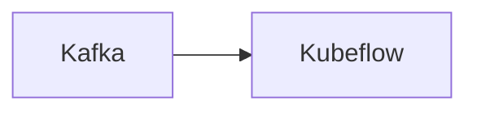

# Connect Kafka to Kubeflow

Quix helps you integrate Kafka to Kubeflow using pure Python.

Here is the Mermaid diagram for integrating Kafka with Kubeflow:

## Kubeflow

Kubeflow is an open-source platform dedicated to making deployments of machine learning workflows on Kubernetes simple, portable, and scalable. It provides a way for data scientists and machine learning engineers to easily build, train, and deploy machine learning models in a cloud-native manner. Kubeflow leverages Kubernetes' scalability and flexibility, allowing users to run machine learning workloads with high availability and efficiency. The platform integrates various tools and frameworks commonly used in the machine learning ecosystem, offering features such as hyperparameter tuning, model serving, and monitoring. Overall, Kubeflow enables organizations to streamline their machine learning workflows and accelerate the development and deployment of AI applications.

## Integrations

Quix Cloud or Quix Streams would be a good fit for integrating with Kubeflow because both platforms offer robust capabilities for developing, deploying, and managing real-time data pipelines. 

1. Streamlined Development and Deployment: Quix Cloud's integrated online code editors and CI/CD tools, along with Quix Streams' support for Python ecosystem integration, make it easy to develop and deploy data pipelines efficiently.

2. Flexible Scaling and Management: Both Quix Cloud and Quix Streams are designed to scale resources easily, manage CPU and memory efficiently, and handle multiple environments, which aligns well with Kubeflow's focus on scalable machine learning workflows.

3. Real-Time Monitoring: Quix Cloud's tools for real-time logs, metrics, and data exploration, as well as Quix Streams' support for time window aggregations, make it possible to monitor pipeline performance and make data-driven decisions in real-time, which is essential for Kubernetes-based deployments in Kubeflow.

4. Security and Compliance: Quix Cloud ensures secure management of secrets and compliance with dedicated infrastructure options, which is crucial for maintaining data privacy and security in Kubernetes environments managed by Kubeflow.

Overall, the features offered by Quix Cloud and Quix Streams align well with the requirements for integrating with Kubeflow, making them a good fit for organizations looking to leverage Kubeflow for their machine learning and data processing workflows.

