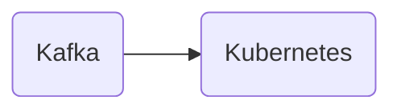

# Connect Kafka to Kubernetes

Quix helps you integrate Kafka to Kubernetes using pure Python.

## Kubernetes

Kubernetes is an open-source platform designed to automate the deployment, scaling, and management of containerized applications. Originally developed by Google, Kubernetes provides a flexible and efficient way to manage containerized workloads in a cluster environment. By abstracting the underlying infrastructure, Kubernetes makes it easier for developers to focus on deploying their applications without worrying about the underlying infrastructure. It enables users to create and manage clusters of virtual machines to run their workloads, while also providing tools for monitoring, scaling, and logging. Overall, Kubernetes is a powerful tool for managing containerized applications at scale, offering a robust and reliable platform for deploying and managing cloud-native applications.

## Integrations

Quix is a good fit for integrating with Kubernetes for several reasons. 

Firstly, Kubernetes is a powerful container orchestration platform that allows for easy scaling and management of containerized applications. Quix Streams and Quix Cloud are designed to run and scale via container orchestration, making them well-suited for deployment on Kubernetes clusters. This ensures that data pipelines can easily adapt to changing workload demands without manual intervention.

Secondly, the streamlined development and deployment features of Quix Streams and Quix Cloud, such as integrated online code editors and CI/CD tools, align well with the automated deployment and scaling capabilities of Kubernetes. This allows for seamless integration of development workflows and facilitates continuous delivery of data pipelines on Kubernetes clusters.

Additionally, the real-time monitoring and scaling capabilities of Quix Cloud complement the monitoring and resource management features of Kubernetes. By leveraging Kubernetes for container orchestration, users can easily scale resources, manage CPU and memory, and monitor critical metrics in real-time, ensuring optimal performance and efficient resource utilization for data pipelines.

Furthermore, the security and compliance features of Quix Cloud, such as secure management of secrets and compliance with dedicated infrastructure options, align with the security best practices and compliance standards supported by Kubernetes. This ensures that data pipelines deployed on Kubernetes clusters through Quix are well-protected and meet regulatory requirements.

In conclusion, the seamless integration of Quix with Kubernetes provides a robust and efficient platform for developing, deploying, and managing real-time data pipelines. The combination of these technologies enables organizations to harness the scalability, flexibility, and automation capabilities of Kubernetes for optimizing data processing workflows and achieving reliable performance at scale.

