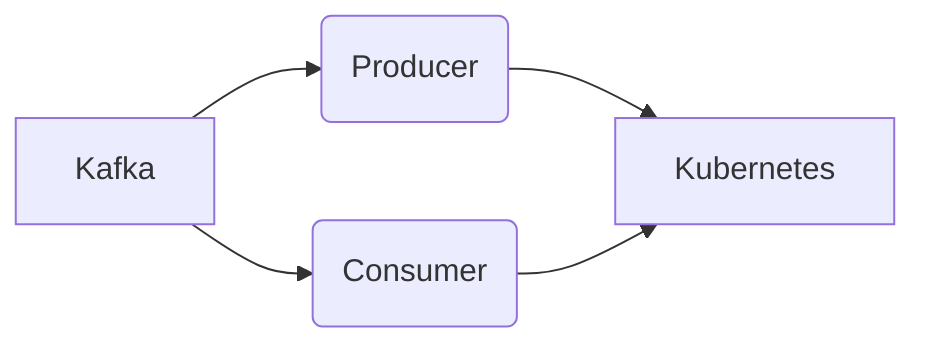

# Connect Kafka to Kubernetes

Quix helps you integrate Kafka to Kubernetes using pure Python.

- __Find out how we can help you integrate!__

    <a class="md-button md-button--primary" href="https://share.hsforms.com/1iW0TmZzKQMChk0lxd_tGiw4yjw2?__hstc=175542013.2303933fbd746c0ac86d9ccbe9bc9100.1728383268831.1729603416735.1729620918855.31&__hssc=175542013.1.1729620918855&__hsfp=2132701734" target="_blank" style="margin:.5rem;">Book a demo</a>

## Kubernetes

Kubernetes is an open-source container orchestration platform that automates the deployment, scaling, and management of containerized applications. It provides a way to package, deploy, and manage applications in a highly efficient manner by grouping containers that make up an application into logical units called pods. Kubernetes allows users to easily scale their applications up or down, roll out updates seamlessly, and monitor the health of their applications. It also provides features for load balancing, auto-scaling, and self-healing, making it an essential tool for organizations looking to deploy and manage large and complex applications in a cloud-native environment.

## Integrations

Quix is a good fit for integrating with Kubernetes because it is a cloud-native platform designed for developing and deploying real-time data pipelines. The key components of Quix, such as streamlined development and deployment, enhanced collaboration, real-time monitoring, flexible scaling and management, security and compliance features, development tools, data exploration and visualization capabilities, and robust CI/CD processes align well with the capabilities of Kubernetes.

Kubernetes is a popular container orchestration tool that allows users to automate the deployment, scaling, and management of containerized applications. Quix can leverage Kubernetes to deploy and scale its data pipelines in a resilient manner, ensuring high availability and efficient resource management. The platform's support for container orchestration also aligns with Kubernetes' ability to manage containerized workloads across different environments.

Additionally, Quix Streams, a cloud-native library for processing data in Kafka using Python, is designed to work seamlessly with Kubernetes for resilient scaling. By utilizing Kubernetes' container orchestration capabilities, Quix Streams can efficiently process data in Kafka while benefiting from Kubernetes' features such as automatic scaling, resource management, and fault tolerance.

In summary, Quix's cloud-native architecture, support for container orchestration, and integration with technologies like Kafka and Python make it a suitable choice for integrating with Kubernetes. By leveraging Kubernetes, Quix can enhance its capabilities for deploying, managing, and scaling real-time data pipelines in a cloud-native environment.

