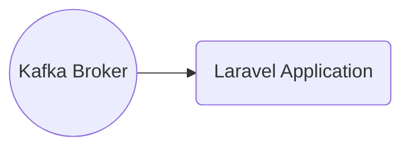

# Connect Kafka to Laravel

Quix helps you integrate Kafka to Laravel using pure Python.

## Laravel

Laravel is a popular open-source PHP framework used for web application development. It provides a range of features that make building complex web applications faster and easier. Laravel follows the MVC (Model-View-Controller) architecture, making it easy to separate concerns and ensure clean and organized code. It offers features like routing, authentication, sessions, and caching out of the box, reducing the need for developers to implement these features manually. Laravel also has a robust ecosystem of libraries, packages, and tools that can further enhance the development process, making it a favorite choice for many developers working on web projects.

## Integrations

Quix is a good fit for integrating with Laravel due to the following reasons:

1. Streamlined Development and Deployment: Quix offers a range of development and deployment tools that can simplify the process of creating and deploying data pipelines. This can be beneficial for Laravel developers who want to streamline their development workflows.

2. Enhanced Collaboration: The platform provides features for organization and permission management, enhancing collaboration among team members working on Laravel projects. This can increase project visibility and control, leading to more efficient development cycles.

3. Real-Time Monitoring: Quix offers tools for real-time monitoring of pipeline performance and critical metrics. This can be useful for Laravel developers who want to track the performance of their applications and make informed decisions based on real-time data.

4. Flexible Scaling and Management: The platform allows users to easily scale resources, manage CPU and memory, and handle multiple environments. This can be beneficial for Laravel developers who need flexibility in managing their applications and resources.

5. Security and Compliance: Quix ensures secure management of secrets and compliance with dedicated infrastructure options and SLAs. This can provide peace of mind for Laravel developers who prioritize security and compliance in their projects.

Overall, integrating Quix with Laravel can enhance development workflows, improve collaboration, provide real-time monitoring capabilities, and offer flexible scaling options, making it a good fit for Laravel developers looking to streamline their data pipeline processes.

