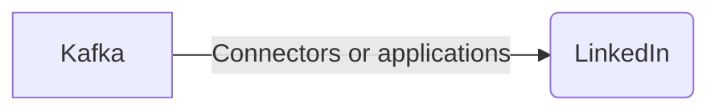

# Connect Kafka to LinkedIn

Quix helps you integrate Kafka to LinkedIn using pure Python.

## LinkedIn

LinkedIn is a popular social networking platform specifically designed for professionals to connect, share insights, and build their professional network. It allows users to create a detailed profile that showcases their skills, experience, and accomplishments. Users can connect with colleagues, peers, and industry experts, as well as follow companies and join groups related to their field. LinkedIn also offers features like job postings, company pages, and messaging capabilities, making it a valuable tool for career advancement and networking opportunities. With over 700 million users worldwide, LinkedIn has become a vital resource for professionals looking to expand their professional connections and stay informed about industry trends.

## Integrations

Quix is a good fit for integrating with technology like LinkedIn because of its comprehensive platform designed for developing, deploying, and managing real-time data pipelines. 

1. Streamlined Development and Deployment: Integrated online code editors and CI/CD tools simplify the creation and deployment of data pipelines. This can help LinkedIn developers quickly implement and deploy data pipelines that integrate with their existing systems.

2. Enhanced Collaboration: Quix Cloud supports efficient collaboration with organization and permission management, increasing project visibility and control. This can help LinkedIn teams work together more effectively on data integration projects.

3. Real-Time Monitoring: Quix Cloud provides tools for real-time logs, metrics, and data exploration, allowing users to monitor pipeline performance and critical metrics. This real-time monitoring capability can be crucial for ensuring the smooth operation of data pipelines that integrate with LinkedIn's systems.

4. Flexible Scaling and Management: Users can easily scale resources, manage CPU and memory, and handle multiple environments linked to Git branches. This flexibility can be useful for LinkedIn developers who need to scale their data pipelines to handle varying levels of data traffic.

5. Security and Compliance: Quix Cloud ensures secure management of secrets and compliance with dedicated infrastructure options and SLAs. This focus on security and compliance aligns well with the high standards that LinkedIn likely has for protecting user data.

In addition, Quix Streams can further enhance the integration with LinkedIn as it is a cloud-native library for processing data in Kafka using Python. This allows for seamless integration with LinkedIn's existing Python ecosystem and serialization formats, as well as providing support for time window aggregations and resilient scaling.

Overall, the features and capabilities of Quix make it a good fit for integrating with technology like LinkedIn, as it provides the tools and functionality needed to efficiently develop, deploy, and manage real-time data pipelines that can support LinkedIn's complex data integration needs.

