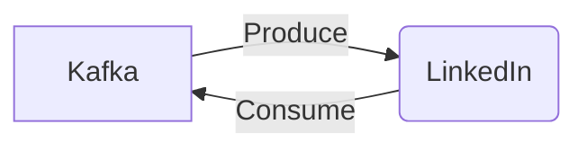

# Connect Kafka to LinkedIn

Quix helps you integrate Kafka to LinkedIn using pure Python.

- __Find out how we can help you integrate!__

    <a class="md-button md-button--primary" href="https://share.hsforms.com/1iW0TmZzKQMChk0lxd_tGiw4yjw2?__hstc=175542013.2303933fbd746c0ac86d9ccbe9bc9100.1728383268831.1729603416735.1729620918855.31&__hssc=175542013.1.1729620918855&__hsfp=2132701734" target="_blank" style="margin:.5rem;">Book a demo</a>

## LinkedIn

LinkedIn is a social networking platform designed specifically for professionals and businesses to connect, network, and explore job opportunities. Users create profiles that showcase their professional experience, education, skills, and achievements, allowing them to connect with colleagues, industry peers, and potential employers. LinkedIn offers various features such as job listings, industry news, professional groups, and messaging, all geared towards fostering professional relationships and opportunities. With over 700 million users worldwide, LinkedIn has become a valuable tool for individuals looking to grow their professional network and advance their careers.

## Integrations

Quix is a good fit for integrating with LinkedIn because of its comprehensive platform designed for developing, deploying, and managing real-time data pipelines. With features like streamlined development and deployment, enhanced collaboration, real-time monitoring, and flexible scaling and management, Quix can help LinkedIn efficiently process and analyze large amounts of data in real-time.

The integration of Quix Streams, a cloud-native library for processing data in Kafka using Python, can further enhance the functionality of LinkedIn's data processing capabilities. With benefits such as no JVM requirement, integration with the Python ecosystem, serialization and state management support, time window aggregations, and resilient scaling, Quix Streams can empower LinkedIn to efficiently process and analyze data from Kafka streams using Python.

Additionally, Quix's support for Kafka integration and dedicated/BYOC options can provide LinkedIn with flexibility and scalability in managing and processing data from various sources. The platform's security and compliance features ensure that sensitive data is handled securely, further aligning with LinkedIn's commitment to data protection.

Overall, Quix's robust development tools, real-time monitoring capabilities, and seamless integration with Git providers make it a perfect fit for LinkedIn's data processing needs, enabling the company to streamline its data pipelines, enhance collaboration, and easily scale resources as needed.

