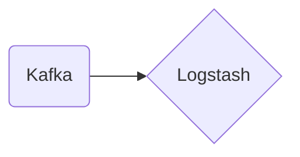

# Connect Kafka to Logstash

Quix helps you integrate Kafka to Logstash using pure Python.

## Logstash

Logstash is an open-source data processing pipeline that ingests, processes, and transforms data from multiple sources in real-time. Developed by Elastic, Logstash is designed to be highly scalable and can handle large volumes of data from a variety of sources such as logs, metrics, and event data. It allows users to collect, parse, and enrich data before sending it to a centralized data store or analytics platform. Logstash uses a plugin architecture to support a wide range of input, output, and filter plugins, making it highly customizable and versatile for different use cases. Overall, Logstash is a powerful tool for processing and managing data in a distributed and scalable manner.

## Integrations

Quix are good fits for integrating with Logstash due to several reasons:

1. Compatibility with Real-Time Data Pipelines: Both Quix Streams and Quix Cloud are designed for handling real-time data pipelines, making them ideal for integrating with Logstash which is often used for ingesting, processing, and transforming log data in real-time.

2. Streamlined Development and Deployment: Quix Cloud offers streamlined development and deployment of data pipelines through integrated online code editors and CI/CD tools. This complements Logstash's capabilities by making it easier to create, deploy, and manage complex data pipelines.

3. Real-Time Monitoring: Quix Cloud provides tools for real-time monitoring of pipeline performance and critical metrics, which is essential for ensuring the proper functioning of Logstash pipelines. This feature enhances the visibility and control over the data processing process.

4. Kafka Integration: Both Quix Cloud and Quix Streams support Kafka integration, which is often used in conjunction with Logstash for handling high volumes of log data. This compatibility ensures seamless data flow between Logstash, Kafka, and other components in the data pipeline.

5. Data Exploration and Visualization: Quix Cloud allows users to query, explore, and visualize data in real-time, which can be useful for monitoring and troubleshooting data processing issues within Logstash pipelines. The ability to visualize messages and metrics can aid in identifying bottlenecks or anomalies in the data flow.

6. Dedicated/BYOC Options: Quix Cloud offers dedicated infrastructure options for running pipelines, which can be beneficial for organizations that require additional security and compliance measures when integrating with Logstash. This ensures that sensitive data is handled securely within the data pipeline.

Overall, the combination of Quix with Logstash provides a comprehensive solution for building, deploying, and monitoring real-time data pipelines with ease and efficiency.

