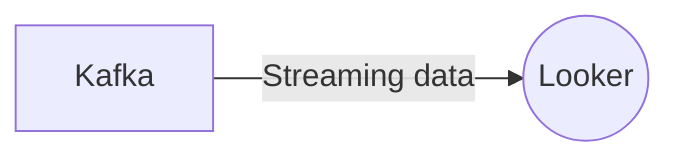

# Connect Kafka to Looker

Quix helps you integrate Kafka to Looker using pure Python.

<a class="md-button md-button--primary" href="https://share.hsforms.com/1iW0TmZzKQMChk0lxd_tGiw4yjw2?__hstc=175542013.2303933fbd746c0ac86d9ccbe9bc9100.1728383268831.1729603416735.1729620918855.31&__hssc=175542013.1.1729620918855&__hsfp=2132701734" target="_blank" style="margin-right:.5rem;">Book a demo</a>
 

## Looker

Looker is a powerful data analytics platform that helps companies make better decisions based on their data. It allows users to easily create and customize reports and dashboards to visualize their data in a way that is easy to understand. With Looker, users can easily connect to various data sources, blend data from multiple sources, and perform complex queries to extract valuable insights. The platform also offers advanced features such as machine learning algorithms and predictive analytics to help businesses identify trends and patterns in their data. Looker is a flexible and scalable tool that can be tailored to meet the specific needs of any organization, making it a valuable asset for companies looking to harness the power of their data.

## Integrations

Quix is a good fit for integrating with Looker because of its comprehensive platform designed for developing, deploying, and managing real-time data pipelines. Looker, as a data visualization and business intelligence tool, can benefit from Quix's features such as streamlined development and deployment, enhanced collaboration, real-time monitoring, flexible scaling and management, security and compliance measures, development tools, data exploration and visualization capabilities, robust CI/CD processes, Kafka integration, and dedicated infrastructure options.

With Quix Streams, a cloud-native library for processing data in Kafka using Python, Looker can leverage the scalability of Kafka while benefiting from a user-friendly Python interface. Quix Streams does not require a JVM, integrates seamlessly with the Python ecosystem, supports serialization and state management, facilitates time window aggregations, allows for resilient scaling via container orchestration, and offers support for local and Jupyter Notebook development.

By integrating Quix with Looker, businesses can enhance their data visualization and analytics capabilities by using a powerful combination of real-time data pipelines and flexible reporting and dashboarding tools. This integration can streamline data workflows, improve collaboration among teams, and provide stakeholders with valuable insights in a timely manner.

