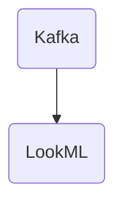

# Connect Kafka to LookML

Quix helps you integrate Kafka to LookML using pure Python.

## LookML

LookML is a powerful technology that allows users to define and organize the data model for their business intelligence and analytics tools. Unlike traditional querying languages that require users to write complex SQL queries, LookML simplifies the process by using a structured, human-readable syntax. This allows users to easily manipulate and analyze their data without having to deal with the intricacies of database queries. LookML also enables users to create reusable data models, reducing redundancy and improving data consistency across an organization. Overall, LookML is a valuable tool for businesses looking to streamline their data analysis processes and make better informed decisions.

## Integrations

Quix Streams and Quix Cloud are well-suited for integrating with LookML due to their strong emphasis on real-time data processing, monitoring, and scalability. LookML is a modeling layer that allows businesses to define their data in a single reusable model. The features of Quix Cloud align well with the needs of organizations using LookML by offering streamlined development and deployment processes, enhanced collaboration capabilities, real-time monitoring of data pipelines, flexible scaling options, and robust CI/CD processes.

Quix Cloud's streamlined development and deployment tools, such as online code editors and CI/CD integration, make it easy for developers to work with LookML and deploy changes quickly. The platform's support for YAML synchronization and defining pipelines as code allows for efficient management of LookML models and environment variables. Additionally, Quix Cloud's enhanced collaboration features, like organization and permission management, help teams working with LookML to increase visibility and control over their projects.

Real-time monitoring and scaling capabilities in Quix Cloud are essential for organizations using LookML to ensure the performance and reliability of their data pipelines. The platform's tools for monitoring logs, metrics, and data exploration enable users to track critical metrics and identify issues in real-time. Quix Cloud's flexible scaling options and management tools make it easy to adjust resources, manage CPU and memory, and handle multiple environments linked to Git branches, supporting the scalability requirements of LookML models.

In addition, Quix Cloud's integration with Git providers like GitHub and Bitbucket facilitates seamless CI/CD processes for organizations using LookML. The platform's support for synchronization via GitHub actions and CLI commands streamlines the deployment and management of LookML models. Overall, the features of Quix Cloud align well with the needs of organizations working with LookML, making it a good fit for integrating with this technology.

