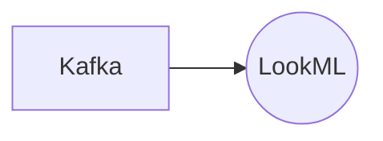

# Connect Kafka to LookML

Quix helps you integrate Kafka to LookML using pure Python.

- __Find out how we can help you integrate!__

    <a class="md-button md-button--primary" href="https://share.hsforms.com/1iW0TmZzKQMChk0lxd_tGiw4yjw2?__hstc=175542013.2303933fbd746c0ac86d9ccbe9bc9100.1728383268831.1729603416735.1729620918855.31&__hssc=175542013.1.1729620918855&__hsfp=2132701734" target="_blank" style="margin:.5rem;">Book a demo</a>

## LookML

LookML is a powerful technology that allows users to define and manage data models for their business intelligence tools. Using LookML, users can easily explore and query their data, create reports and visualizations, and share insights with their team. LookML simplifies the process of modeling data, making it easier for non-technical users to understand and manipulate. This technology provides a structured and organized way to work with data, making it easier for businesses to make informed decisions based on their data analysis. LookML is highly customizable, allowing users to tailor their data models to fit their specific needs and workflows. Overall, LookML is a valuable tool for businesses looking to harness the power of their data for better decision-making and improved performance.

## Integrations

Quix is a good fit for integrating with LookML because it offers a range of features that align well with LookML's capabilities and requirements. 

1. Streamlined Development and Deployment: Quix's integrated online code editors and CI/CD tools simplify the creation and deployment of data pipelines, which can easily be integrated with LookML models.

2. Enhanced Collaboration: Quix's support for efficient collaboration through organization and permission management allows teams to work together seamlessly on LookML projects.

3. Real-Time Monitoring: Quix Cloud provides tools for real-time logs, metrics, and data exploration, which can be crucial for monitoring LookML models' performance and detecting any issues in real-time.

4. Flexible Scaling and Management: Quix's ability to easily scale resources and manage multiple environments can be advantageous for handling large LookML projects and accommodating fluctuating data volumes.

5. Security and Compliance: Quix Cloud ensures secure management of secrets, which is essential for maintaining data security and compliance when working with LookML models.

6. Development Tools: Quix's online code editors and connectors for various data sources align well with LookML's data modeling capabilities, supporting a streamlined development workflow.

7. Data Exploration and Visualization: Quix's ability to query and explore data, visualize messages and metrics in real-time can enhance the data exploration capabilities of LookML models.

8. Robust CI/CD Processes: Integration with Git providers like GitHub and Bitbucket streamlines the CI/CD processes for LookML models, ensuring smooth integration and deployment.

In conclusion, Quix's comprehensive platform and features make it a suitable choice for integrating with LookML, providing a seamless and efficient environment for developing, deploying, and managing data pipelines that complement LookML's capabilities.

