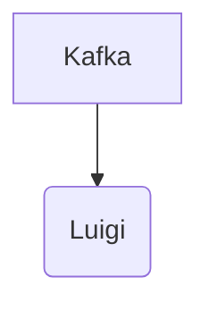

# Connect Kafka to Luigi

Quix helps you integrate Kafka to Luigi using pure Python.

- __Find out how we can help you integrate!__

    <a class="md-button md-button--primary" href="https://share.hsforms.com/1iW0TmZzKQMChk0lxd_tGiw4yjw2?__hstc=175542013.2303933fbd746c0ac86d9ccbe9bc9100.1728383268831.1729603416735.1729620918855.31&__hssc=175542013.1.1729620918855&__hsfp=2132701734" target="_blank" style="margin:.5rem;">Book a demo</a>

## Luigi

Luigi is a powerful data pipeline framework that enables users to build complex workflows in Python. Developed by Spotify, Luigi allows users to define tasks that depend on each other, creating a visual representation of the workflow. This technology makes it easy to schedule and run data pipelines, ensuring that tasks are executed in the correct order and dependencies are met. Luigi also provides monitoring and error handling capabilities, allowing users to track the progress of their pipelines and troubleshoot any issues that arise. Overall, Luigi is a versatile and efficient tool for managing data pipelines in a scalable and reliable way.

## Integrations

Quix is a good fit for integrating with Luigi because Quix Cloud provides a comprehensive platform for developing, deploying, and managing real-time data pipelines, while Luigi is a Python module that helps you build complex pipelines of batch jobs. The key components of Quix Cloud, such as streamlined development and deployment, enhanced collaboration, real-time monitoring and scaling capabilities, and robust CI/CD processes complement the functionality of Luigi.

One of the key features of Quix Cloud is its flexible scaling and management capabilities, which align well with Luigi's ability to handle complex pipelines. Quix Cloud's support for real-time monitoring and visualization also complements Luigi's capabilities by providing tools for monitoring pipeline performance and critical metrics. Additionally, Quix Streams, a cloud-native library for processing data in Kafka using Python, integrates seamlessly with Luigi, as both tools support Python ecosystem integration.

Furthermore, Quix Cloud's security and compliance features ensure that data processing within Luigi pipelines is securely managed, ensuring compliance with various regulations. The platform's support for dedicated infrastructure options aligns well with Luigi's requirements for running complex pipelines on specific environments.

In summary, Quix's comprehensive platform for developing, deploying, and managing real-time data pipelines, along with its support for Python ecosystem integration and dedicated infrastructure options, make it a good fit for integrating with Luigi to build and manage complex batch job pipelines efficiently.

