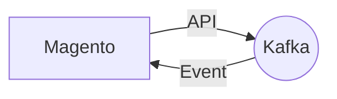

# Connect Kafka to Magento

Quix helps you integrate Kafka to Magento using pure Python.

## Magento

Magento is a powerful and versatile open-source e-commerce platform that enables businesses to create and manage online stores with ease. Known for its scalability and flexibility, Magento provides a robust set of features and tools that allow businesses to customize their online stores to meet their specific needs. With a user-friendly interface and advanced functionality, Magento enables businesses to create seamless and engaging shopping experiences for their customers. Whether it's managing inventory, processing payments, or optimizing website performance, Magento offers a comprehensive solution for businesses looking to enhance their online presence and drive sales.

## Integrations

Magento is a popular e-commerce platform that requires real-time data processing and monitoring to ensure a seamless shopping experience for users. Quix Cloud and Quix Streams offer the necessary tools and features to seamlessly integrate with Magento and enhance its capabilities.

With Quix Cloud's streamlined development and deployment features, developers can easily create and deploy real-time data pipelines for Magento, improving the overall performance and efficiency of the e-commerce platform. The platform's enhanced collaboration tools also allow for better project management and control, ensuring that all team members are on the same page when integrating with Magento.

Real-time monitoring and scaling capabilities provided by Quix Cloud are crucial for monitoring the performance of Magento's data pipelines and ensuring that they can handle the demands of an e-commerce platform. The platform's flexibility in scaling resources and managing CPU and memory allows for seamless integration with Magento, adapting to the changing needs of the online store.

Quix Streams, with its Python interface and seamless integration with Kafka, offers a convenient way to process data for Magento using Python. Its support for serialization formats, time window aggregations, and resilient scaling makes it a perfect fit for handling the data processing requirements of an e-commerce platform like Magento.

Overall, Quix Cloud and Quix Streams provide the necessary tools and features to streamline the integration of real-time data processing with Magento, enhancing its performance, scalability, and monitoring capabilities. By leveraging these technologies, Magento can deliver a more efficient and responsive shopping experience for its users.

