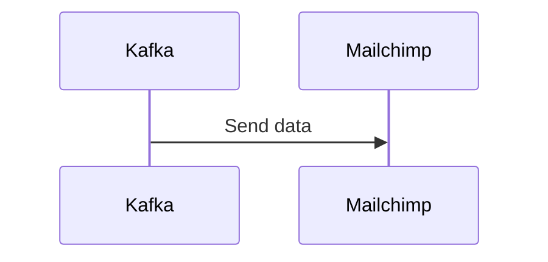

# Connect Kafka to Mailchimp

Quix helps you integrate Kafka to Mailchimp using pure Python.

## Mailchimp

Mailchimp is a popular email marketing automation platform that allows users to create and send marketing emails to their customers easily. With Mailchimp, businesses can build custom email campaigns, personalize messages for specific audiences, and track the success of their campaigns through detailed analytics. The platform also offers tools for managing contact lists, creating signup forms, and integrating with other marketing platforms. Mailchimp's user-friendly interface and extensive library of templates make it a popular choice for businesses of all sizes looking to grow their customer base through email marketing efforts.

## Integrations

Quix is a good fit for integrating with Mailchimp because of its comprehensive features that streamline development, enhance collaboration, and provide real-time monitoring and scaling capabilities. 

1. Streamlined Development and Deployment: The integrated online code editors and CI/CD tools in Quix Cloud make it easy to create and deploy data pipelines, which can be essential for integrating with a complex platform like Mailchimp.

2. Enhanced Collaboration: Quix Cloud supports organization and permission management, increasing project visibility and control. This can be crucial for teamwork on integration projects involving multiple stakeholders.

3. Real-Time Monitoring: With tools for real-time logs, metrics, and data exploration, Quix Cloud allows users to monitor pipeline performance and critical metrics when integrating with Mailchimp, ensuring that data is flowing smoothly.

4. Flexible Scaling and Management: Quix Cloud makes it easy to scale resources, manage CPU and memory, and handle multiple environments linked to Git branches, which can be useful for integrating with a dynamic platform like Mailchimp.

5. Security and Compliance: Quix Cloud ensures secure management of secrets and compliance with dedicated infrastructure options and SLAs, providing peace of mind when integrating with a platform like Mailchimp that deals with sensitive customer data.

6. Development Tools: Quix Cloud provides online code editors, code templates, and connectors for various data sources and sinks, which can facilitate the development of integrations with Mailchimp.

7. Data Exploration and Visualization: Users can query and explore data using waveform and table views in Quix Cloud, which can help in understanding and manipulating data when integrating with Mailchimp.

Overall, the features of Quix make it a strong choice for integrating with Mailchimp, providing the necessary tools and capabilities to ensure a smooth and efficient integration process.

