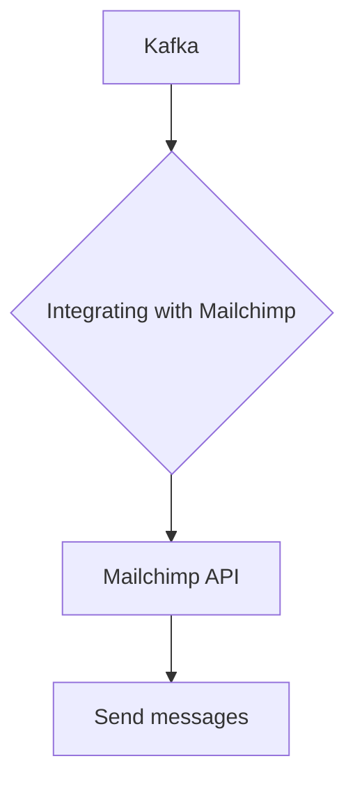

# Connect Kafka to Mailchimp

Quix helps you integrate Kafka to Mailchimp using pure Python.

<a class="md-button md-button--primary" href="https://share.hsforms.com/1iW0TmZzKQMChk0lxd_tGiw4yjw2?__hstc=175542013.2303933fbd746c0ac86d9ccbe9bc9100.1728383268831.1729603416735.1729620918855.31&__hssc=175542013.1.1729620918855&__hsfp=2132701734" target="_blank" style="margin-right:.5rem;">Book a demo</a>
 

## Mailchimp

Mailchimp is a popular email marketing software that allows users to create, send, and track email campaigns to their target audience. This technology provides a user-friendly platform with customizable templates and tools to easily design professional-looking emails. Mailchimp offers features such as audience segmentation, automation, and analytics to help users reach their marketing goals. With Mailchimp, businesses can create personalized campaigns, analyze the success of their emails, and optimize their marketing strategies to engage and convert leads into customers.

## Integrations

Quix is a good fit for integrating with Mailchimp because of its real-time data processing capabilities and seamless integration with third-party solutions like Kafka. With Quix Cloud's robust CI/CD processes and flexible scaling options, users can easily streamline the development and deployment of data pipelines, ensuring efficient and reliable data processing.

Additionally, Quix Streams, a cloud-native library designed for processing data in Kafka using Python, provides a user-friendly interface for handling data within the Mailchimp ecosystem. Its support for various serialization formats, time window aggregations, and resilient scaling makes it a valuable tool for handling large volumes of data and ensuring smooth integration with Mailchimp's platform.

Overall, Quix's comprehensive platform and versatile development tools make it well-suited for integrating with Mailchimp, offering users the ability to efficiently manage and process data in real-time.

