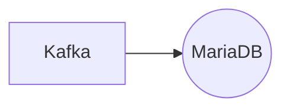

# Connect Kafka to MariaDB

Quix helps you integrate Kafka to MariaDB using pure Python.

## MariaDB

MariaDB is an open-source, relational database management system that was created as a drop-in replacement for MySQL. It was developed by the original developers of MySQL after concerns about Oracle's acquisition of the MySQL project. MariaDB aims to maintain compatibility with MySQL while also offering additional features and enhancements. It provides high performance, scalability, and robust security features, making it suitable for a wide range of applications. MariaDB also supports a variety of storage engines, including InnoDB and Aria, allowing users to customize their database configurations to fit their specific needs. Additionally, MariaDB offers comprehensive support and documentation, making it a popular choice for organizations looking for a reliable and feature-rich database solution.

## Integrations

MariaDB is an open-source relational database management system that is known for its performance, reliability, and ease of use. When integrating with Quix, MariaDB can serve as a data source or sink for data pipelines developed and deployed in these platforms.

Here are some reasons why Quix is a good fit for integrating with MariaDB:

1. Streamlined Development and Deployment: Quix Cloud provides integrated online code editors and CI/CD tools that simplify the creation and deployment of data pipelines. Developers can easily connect to MariaDB as a data source or sink in their pipelines, streamlining the development process.

2. Real-Time Monitoring: Quix Cloud offers tools for real-time logs, metrics, and data exploration, allowing users to monitor pipeline performance. By integrating with MariaDB, users can monitor the flow of data between their pipelines and the database in real-time, ensuring data consistency and accuracy.

3. Flexible Scaling: Quix Cloud allows users to easily scale resources and manage multiple environments. By integrating with MariaDB, users can scale their database resources according to the needs of their data pipelines, ensuring efficient data processing and storage.

4. Data Exploration and Visualization: Quix Cloud enables users to query and explore data using waveform and table views, making it easy to visualize data in real-time. By integrating with MariaDB, users can analyze and visualize data stored in the database, gaining insights into their data pipelines and performance.

5. Security and Compliance: Quix Cloud ensures secure management of secrets and compliance with dedicated infrastructure options. By integrating with MariaDB, users can securely access and manage their database credentials, ensuring data security and compliance with regulations.

Overall, Quix is a good fit for integrating with MariaDB due to its streamlined development and deployment processes, real-time monitoring capabilities, flexible scaling options, data exploration and visualization tools, and security and compliance features. This integration can help organizations efficiently manage and process data using the power of MariaDB within the Quix ecosystem.

