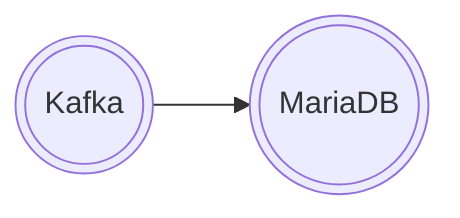

# Connect Kafka to MariaDB

Quix helps you integrate Kafka to MariaDB using pure Python.

<a class="md-button md-button--primary" href="https://share.hsforms.com/1iW0TmZzKQMChk0lxd_tGiw4yjw2?__hstc=175542013.2303933fbd746c0ac86d9ccbe9bc9100.1728383268831.1729603416735.1729620918855.31&__hssc=175542013.1.1729620918855&__hsfp=2132701734" target="_blank" style="margin-right:.5rem;">Book a demo</a>
 

## MariaDB

MariaDB is an open-source relational database management system that is a fork of MySQL. It was created by the original developers of MySQL after concerns arose about the acquisition of MySQL by Oracle Corporation. MariaDB is designed for high performance, scalability, and reliability, with features such as multi-version concurrency control and parallel replication. It maintains compatibility with MySQL, making it a popular choice for organizations looking to switch from MySQL without changing their existing applications. MariaDB is widely used in web development, data warehousing, and e-commerce applications, and is known for its community-driven development model and active developer community.

## Integrations

Quix is a good fit for integrating with MariaDB because of its comprehensive platform capabilities that align with the requirements of managing real-time data pipelines with MariaDB. 

Firstly, Quix Cloud's streamlined development and deployment features, such as integrated online code editors and CI/CD tools, simplify the creation and deployment of data pipelines. This aligns well with the need to efficiently manage and deploy data with MariaDB.

Secondly, the platform's enhanced collaboration tools support efficient teamwork and organization management, which can increase project visibility and control when working with MariaDB.

The real-time monitoring capabilities of Quix Cloud are crucial for monitoring pipeline performance and metrics in real-time, which is essential for managing data pipelines effectively with MariaDB.

Flexible scaling and management options provided by Quix Cloud allow users to easily adjust resources and manage multiple environments, which is valuable for handling the scalability of data pipelines involving MariaDB.

Furthermore, the secure management of secrets and compliance measures offered by Quix Cloud align with the security requirements of working with MariaDB.

In addition, Quix Cloud's development tools, data exploration and visualization features, robust CI/CD processes, and integration with Kafka all provide valuable functionalities for integrating with MariaDB and enhancing data pipeline management.

When it comes to Quix Streams, its cloud-native library for processing data in Kafka using Python can also complement MariaDB integration by providing benefits such as seamless integration with Python ecosystem libraries, support for various serialization formats, time window aggregations, and resilient scaling capabilities.

Overall, Quix's comprehensive platform capabilities align well with the requirements of integrating with MariaDB and effectively managing real-time data pipelines.

