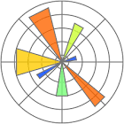
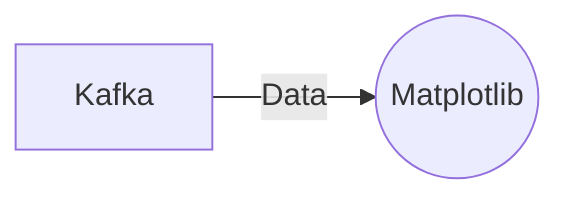

# Connect Kafka to Matplotlib

Quix helps you integrate Kafka to Matplotlib using pure Python.

<a class="md-button md-button--primary" href="https://share.hsforms.com/1iW0TmZzKQMChk0lxd_tGiw4yjw2?__hstc=175542013.2303933fbd746c0ac86d9ccbe9bc9100.1728383268831.1729603416735.1729620918855.31&__hssc=175542013.1.1729620918855&__hsfp=2132701734" target="_blank" style="margin-right:.5rem;">Book a demo</a>
 

## Matplotlib

Matplotlib is a powerful and versatile data visualization library in Python that is widely used for creating visually appealing plots and charts. It provides a wide range of plotting functions and customization options, allowing users to create highly interactive and informative visualizations. With Matplotlib, users can create line plots, scatter plots, bar charts, histograms, heatmaps, and much more. The library is highly flexible and can be easily integrated with other Python libraries and tools, making it a popular choice for data analysts and scientists looking to explore and communicate their data effectively.

## Integrations

Matplotlib is a popular data visualization library in Python that is widely used for creating plots, charts, and graphs. It provides a wide range of functionalities for visualizing data in a variety of formats. 

Quix, on the other hand, is a comprehensive platform for developing, deploying, and managing real-time data pipelines. It offers a range of features such as streamlined development and deployment, enhanced collaboration, real-time monitoring, and flexible scaling capabilities. Quix Streams is a cloud-native library for processing data in Kafka using Python, which operates without a server-side engine or orchestrator and integrates seamlessly with Python libraries like Pandas, scikit-learn, TensorFlow, and PyTorch.

Given that both Matplotlib and Quix support Python integration, they are a good fit for integrating with each other. With Quix's support for Python and data processing capabilities, developers can easily extract data from Kafka streams using Quix Streams and then use Matplotlib to visualize the data in various formats such as line plots, bar charts, scatter plots, and more. This seamless integration allows users to have a comprehensive data visualization and processing pipeline within the Quix platform, enhancing their ability to analyze and interpret data in real-time.

