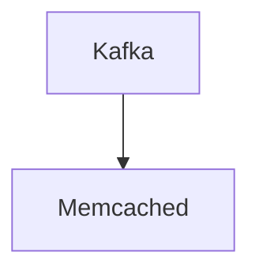

# Connect Kafka to Memcached

Quix helps you integrate Kafka to Memcached using pure Python.

## Memcached

Memcached is a high-performance, distributed memory caching system that is commonly used in web applications to improve their speed and efficiency. It operates by storing frequently accessed data in memory, which allows for quick retrieval and minimizes the need to access data from disk, reducing the overall load on the database servers. Memcached is designed to be a simple and lightweight solution, making it easy to implement and can be used across a variety of programming languages. It is often used to cache user sessions, database query results, and other frequently accessed data, helping to improve the overall performance of web applications.

## Integrations

Memcached is a high-performance, distributed memory caching system that is commonly used to improve the performance of web applications by caching frequently accessed data in memory. When integrating Memcached with a real-time data processing platform like Quix, there are several key advantages:

1. Fast Data Access: Memcached allows for quick access to frequently accessed data, which can be crucial in real-time data processing scenarios where speed is essential.

2. Scalability: Memcached is designed for scalability, making it a good fit for handling large amounts of data in real-time data pipelines. Quix Streams and Quix Cloud also provide flexible scaling capabilities, allowing for seamless integration with Memcached.

3. Reduced Database Load: By caching data in memory, Memcached can help reduce the load on databases, leading to improved performance and efficiency in data processing pipelines.

4. Enhanced Performance: The combination of Memcached's fast data access and Quix Streams' efficient data processing capabilities can result in enhanced performance and responsiveness in real-time data pipelines.

5. Seamless Integration: Quix Streams' Python interface and support for serialization formats make it easy to integrate with Memcached, enabling developers to leverage the benefits of both technologies in their data processing workflows.

Overall, the combination of Memcached with Quix can provide a powerful and efficient solution for developing, deploying, and managing real-time data pipelines that require fast access to cached data.

