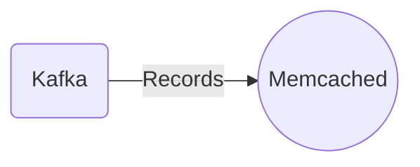

# Connect Kafka to Memcached

Quix helps you integrate Kafka to Memcached using pure Python.

<a class="md-button md-button--primary" href="https://share.hsforms.com/1iW0TmZzKQMChk0lxd_tGiw4yjw2?__hstc=175542013.2303933fbd746c0ac86d9ccbe9bc9100.1728383268831.1729603416735.1729620918855.31&__hssc=175542013.1.1729620918855&__hsfp=2132701734" target="_blank" style="margin-right:.5rem;">Book a demo</a>
 

## Memcached

Memcached is an open-source, high-performance, distributed memory caching system designed to speed up dynamic web applications by alleviating database load. It works by storing data and objects in memory, allowing for quick access to frequently accessed information. By caching data in memory, Memcached reduces the need to query the database repeatedly, resulting in faster response times and improved performance. It is commonly used in web applications to store frequently accessed data such as HTML fragments, database query results, and API responses. Memcached uses a client-server architecture and supports multiple programming languages, making it a versatile and widely used technology in the world of web development.

## Integrations

Quix is a good fit for integrating with Memcached because Quix Cloud's features align well with the capabilities and requirements of Memcached in a data processing pipeline.

One key aspect of Quix Cloud is its real-time monitoring and scaling capabilities. Memcached is often used for caching and improving the performance of applications by storing frequently accessed data in memory. By integrating Quix with Memcached, users can benefit from the real-time monitoring tools in Quix Cloud to track the performance of their data pipelines and ensure optimal utilization of the cached data in Memcached.

Additionally, Quix Streams, a cloud-native library for processing data in Kafka using Python, provides seamless integration with Kafka, which is commonly used as a data source for Memcached. The serialization and state management features of Quix Streams also complement the requirements of working with data in Memcached, enabling efficient processing and storage of data.

Furthermore, the streamlined development and deployment tools in Quix Cloud, such as the integrated online code editors and CI/CD tools, simplify the creation and deployment of data pipelines that utilize Memcached. This enhances collaboration among team members and ensures efficient development workflows when integrating Memcached into the data processing pipeline.

Overall, the comprehensive features of Quix Cloud, along with the capabilities of Quix Streams, make it a suitable platform for integrating with Memcached and leveraging its caching capabilities effectively in real-time data pipelines.

