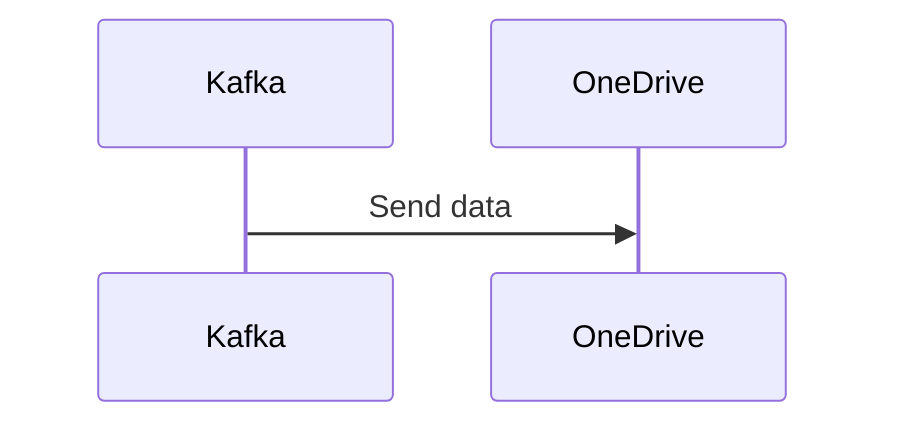

# Connect Kafka to Microsoft OneDrive

Quix helps you integrate Kafka to Microsoft OneDrive using pure Python.

## Microsoft OneDrive

Microsoft OneDrive is a cloud storage service provided by Microsoft that allows users to store, share, and access files from any device with an internet connection. With OneDrive, users can store documents, photos, videos, and more in a secure cloud-based environment, eliminating the need to carry around physical storage devices. OneDrive also offers collaboration features, allowing users to work on documents with others in real-time. Additionally, OneDrive seamlessly integrates with other Microsoft products, such as Office 365, making it easy to save and share files across different platforms. Overall, Microsoft OneDrive provides a convenient and efficient way for users to access their files anytime, anywhere.

## Integrations

Quix is a good fit for integrating with Microsoft OneDrive because it offers a comprehensive platform with features that complement the requirements of managing real-time data pipelines. 

Firstly, Quix Cloud provides streamlined development and deployment tools such as integrated online code editors and CI/CD tools, which can simplify the creation and deployment of data pipelines. This can be beneficial when integrating with Microsoft OneDrive, as developers can easily manage and update the pipelines required for data integration.

Enhanced collaboration features of Quix Cloud, including organization and permission management, can also be advantageous when integrating with Microsoft OneDrive. These features can help increase project visibility and control, ensuring efficient collaboration between teams working on the integration.

Furthermore, the real-time monitoring capabilities of Quix Cloud allow users to monitor pipeline performance and critical metrics, which can be essential for ensuring the smooth integration of Microsoft OneDrive with data pipelines. Users can easily scale resources, manage CPU and memory, and handle multiple environments, providing flexibility and control over the integration process.

Quix Cloud also offers security and compliance features, ensuring the secure management of secrets and compliance with dedicated infrastructure options and SLAs. This can be crucial when integrating with a platform like Microsoft OneDrive, which deals with sensitive data that requires high levels of security.

Overall, the features and capabilities of Quix make it a strong choice for integrating with Microsoft OneDrive, as it provides the necessary tools and functionalities to streamline development, enhance collaboration, monitor performance, and ensure security and compliance in data pipeline management.

