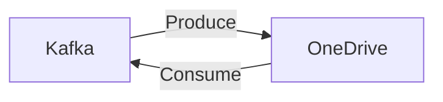

# Connect Kafka to Microsoft OneDrive

Quix helps you integrate Kafka to Microsoft OneDrive using pure Python.

<a class="md-button md-button--primary" href="https://share.hsforms.com/1iW0TmZzKQMChk0lxd_tGiw4yjw2?__hstc=175542013.2303933fbd746c0ac86d9ccbe9bc9100.1728383268831.1729603416735.1729620918855.31&__hssc=175542013.1.1729620918855&__hsfp=2132701734" target="_blank" style="margin-right:.5rem;">Book a demo</a>
 

## Microsoft OneDrive

Microsoft OneDrive is a cloud storage service provided by Microsoft that allows users to store, access, and share files securely from any device connected to the internet. With OneDrive, users can store documents, photos, videos, and other files in the cloud, eliminating the need for physical storage devices like USB drives or external hard drives. OneDrive also integrates seamlessly with other Microsoft products, such as Office 365, allowing users to easily collaborate on documents and access their files across multiple devices. Additionally, OneDrive offers features like automatic file syncing, file versioning, and advanced security measures to ensure that users' data remains protected at all times. With its user-friendly interface and robust feature set, OneDrive is a convenient and reliable solution for individuals and businesses looking to streamline their file storage and sharing processes.

## Integrations

Quix is a good fit for integrating with Microsoft OneDrive because both platforms focus on streamlining development, enhancing collaboration, and providing real-time monitoring and scaling capabilities.

Quix Cloud's streamlined development and deployment features, such as integrated online code editors and CI/CD tools, align well with OneDrive's emphasis on making it easy for users to create and deploy data pipelines. By integrating Quix's YAML synchronization for defining pipelines and environment variables as code with OneDrive's file storage capabilities, users can efficiently manage their development workflow and store their pipeline configurations in a centralized location.

Additionally, Quix Cloud's enhanced collaboration tools, including organization and permission management, complement OneDrive's features for sharing and collaborating on documents. This integration can improve project visibility and control, allowing teams to work together more effectively on data pipeline development.

Furthermore, Quix's real-time monitoring and flexible scaling capabilities can enhance the performance and management of data pipelines stored and accessed through OneDrive. By leveraging Quix's tools for monitoring pipeline performance and scaling resources as needed, users can ensure that their data pipelines running on Microsoft OneDrive are operating optimally and efficiently.

Overall, the compatibility of Quix's features with the functionalities of Microsoft OneDrive makes it a suitable choice for integrating with the cloud storage platform to streamline data pipeline development, enhance collaboration, and provide real-time monitoring and scaling capabilities.

