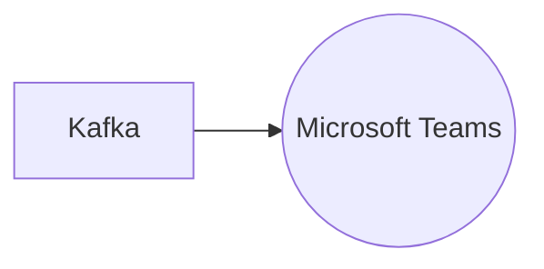

# Connect Kafka to Microsoft Teams

Quix helps you integrate Kafka to Microsoft Teams using pure Python.

## Microsoft Teams

Microsoft Teams is a cutting-edge communication and collaboration tool developed by Microsoft. It is designed to integrate seamlessly with other Microsoft Office applications, allowing users to chat, video conference, share files, and collaborate on projects all within one platform. Teams provides a virtual workspace where team members can easily communicate and work together regardless of their location. With features such as screen sharing, file sharing, and instant messaging, Microsoft Teams makes it easy for teams to stay organized and productive. Additionally, Teams allows for integration with third-party apps and services, making it a versatile tool for businesses of all sizes. Overall, Microsoft Teams revolutionizes the way teams collaborate and communicate, providing a streamlined and efficient platform for remote work and collaboration.

## Integrations

Quix Streams and Quix Cloud are a good fit for integrating with Microsoft Teams because they offer a comprehensive platform for developing, deploying, and managing real-time data pipelines. Microsoft Teams is a collaboration platform that allows users to work together on projects, share documents, and communicate in real-time. By integrating Quix with Microsoft Teams, teams can streamline development processes, enhance collaboration, and monitor pipeline performance in real-time.

The streamlined development and deployment features of Quix Cloud make it easy to create and deploy data pipelines, while the enhanced collaboration tools allow for efficient project management and visibility. Real-time monitoring capabilities offered by Quix Cloud enable users to monitor pipeline performance and critical metrics, ensuring that any issues can be addressed quickly.

Additionally, the flexibility in scaling resources and managing environments provided by Quix Cloud make it a great fit for integrating with Microsoft Teams, as teams can easily adjust resources and handle multiple environments linked to Git branches. The security and compliance features of Quix Cloud also ensure that data is managed securely and in compliance with regulations.

Furthermore, the features of Quix Streams, such as its seamless integration with the Python ecosystem and support for time window aggregations, make it a valuable tool for processing data in Kafka. By integrating Quix Streams with Microsoft Teams, teams can leverage the scalability of Kafka and the user-friendly Python interface to efficiently process and analyze data.

Overall, the features and capabilities of Quix Streams and Quix Cloud make them well-suited for integrating with Microsoft Teams to enhance collaboration, streamline development processes, and monitor data pipelines in real-time.

