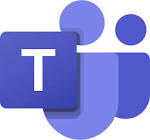
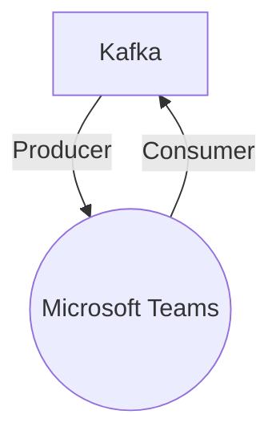

# Connect Kafka to Microsoft Teams

Quix helps you integrate Kafka to Microsoft Teams using pure Python.

<a class="md-button md-button--primary" href="https://share.hsforms.com/1iW0TmZzKQMChk0lxd_tGiw4yjw2?__hstc=175542013.2303933fbd746c0ac86d9ccbe9bc9100.1728383268831.1729603416735.1729620918855.31&__hssc=175542013.1.1729620918855&__hsfp=2132701734" target="_blank" style="margin-right:.5rem;">Book a demo</a>
 

## Microsoft Teams

Microsoft Teams is a collaboration platform that allows users to communicate, share files, and collaborate on projects in real-time. It integrates with Microsoft Office applications, making it easy to create and edit documents, spreadsheets, and presentations directly within the platform. Users can have video and audio meetings with team members, as well as chat using the built-in messaging feature. Teams also offers the ability to create channels for different projects or departments, making it easy to organize and access information. Overall, Microsoft Teams is a powerful tool for remote teamwork and communication.

## Integrations

Quix is a good fit for integrating with Microsoft Teams because it offers a comprehensive platform for developing, deploying, and managing real-time data pipelines. Microsoft Teams is a collaborative platform that allows teams to work together effectively and efficiently, making it essential to have tools that streamline development, enhance collaboration, and provide real-time monitoring capabilities.

Quix's streamlined development and deployment features, such as integrated online code editors and CI/CD tools, align well with the need for efficient collaboration in Microsoft Teams. The platform's enhanced collaboration capabilities, including organization and permission management, will help increase project visibility and control within Teams.

Additionally, Quix's real-time monitoring tools will enable Teams users to monitor pipeline performance and critical metrics directly within the Microsoft Teams interface. The platform's flexible scaling and management capabilities will also be valuable for Teams users looking to easily scale resources and manage multiple environments.

Moreover, Quix Cloud's security and compliance features will help ensure the secure management of data within Microsoft Teams, providing peace of mind for organizations handling sensitive information. The platform's development tools, data exploration and visualization capabilities, robust CI/CD processes, and integration with Kafka will further enhance collaboration and productivity within Microsoft Teams.

Furthermore, the integration of Quix Streams, a cloud-native library for processing data in Kafka using Python, will be beneficial for Microsoft Teams users who prefer working with Python. The library's seamless integration with Python ecosystem libraries, support for serialization and state management, time window aggregations, and resilient scaling make it a valuable addition to the collaboration tools available in Microsoft Teams.

Overall, Quix's comprehensive features and seamless integration with Microsoft Teams make it a strong fit for organizations looking to streamline their development processes, enhance collaboration, and effectively manage real-time data pipelines within the Teams platform.

