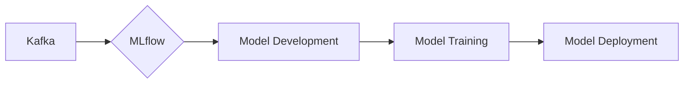

# Connect Kafka to MLflow

Quix helps you integrate Kafka to MLflow using pure Python.

## MLflow

MLflow is an open-source platform that provides machine learning lifecycle management. It allows data scientists to easily track experiments, package their code, and deploy models to different environments. MLflow helps organizations keep track of their machine learning projects, understand how models are performing, and streamline the process of building, training, and deploying models. With MLflow, data scientists can efficiently collaborate, reproduce results, and manage the end-to-end machine learning pipeline in a structured and scalable way.

## Integrations

MLflow is an open-source platform for managing the end-to-end machine learning lifecycle. It includes tools for tracking experiments, packaging code into reproducible runs, and sharing and deploying models. Quix is a good fit for integrating with MLflow because of its seamless integration with Kafka, scalability, flexibility, and ease of use.

1. Kafka Integration: Quix Streams, being a cloud-native library for processing data in Kafka, seamlessly integrates with Kafka, which is an essential component for real-time data processing. MLflow can benefit from Quix Streams' ability to process data in Kafka using Python, enabling seamless integration between the two technologies.

2. Scalability: Quix Streams supports resilient scaling via container orchestration, such as Kubernetes. This scalability feature aligns well with the scalability needs of MLflow, which may require processing large volumes of data for machine learning experiments. By leveraging Quix Streams' scalability features, MLflow can efficiently manage the processing of experimental data and models.

3. Flexibility and Ease of Use: Quix Streams offers a user-friendly Python interface, making it easy to work with for data processing tasks. MLflow can leverage this ease of use to streamline its data processing pipeline and enhance the overall machine learning lifecycle management experience. The flexibility of Quix Streams also allows for robust serialization and state management, key components needed for managing machine learning models.

4. Local and Jupyter Notebook Support: Quix Streams provides support for local and Jupyter Notebook environments, enabling convenient development and debugging. MLflow users can benefit from this support by easily experimenting with machine learning models in a familiar environment, improving productivity and collaboration.

In conclusion, Quix is a good fit for integrating with MLflow due to its Kafka integration, scalability, flexibility, and ease of use. By combining the strengths of both platforms, users can enhance their machine learning lifecycle management experience, streamline data processing tasks, and ensure efficient and scalable deployment of machine learning models.

