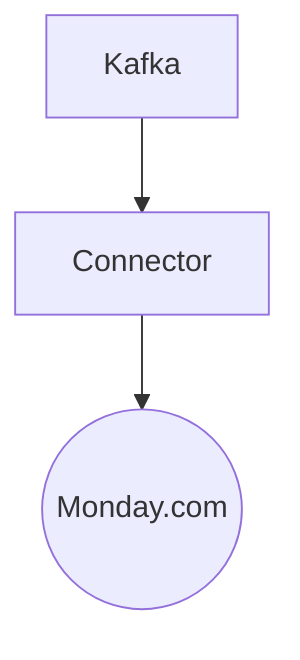

# Connect Kafka to Monday.com

Quix helps you integrate Kafka to Monday.com using pure Python.

## Monday.com

Monday.com is an innovative project management and collaboration tool that streamlines communication and organization within a team. This technology allows team members to track progress on tasks, set deadlines, assign responsibilities, and communicate with one another all in one convenient platform. With customizable boards, users can create workflows that suit their specific needs and easily visualize project timelines and milestones. Monday.com also features integrations with popular apps and tools, making it a versatile solution for teams of all sizes and industries. Its user-friendly interface and intuitive design make it a top choice for teams looking to improve productivity and efficiency in their day-to-day operations.

## Integrations

Quix are a good fit for integrating with Monday.com because they provide a comprehensive platform for developing, deploying, and managing real-time data pipelines. This aligns well with Monday.com's focus on providing a visual and collaborative workspace for teams to manage projects and workflows.

The streamlined development and deployment features of Quix Cloud, such as integrated online code editors and CI/CD tools, make it easy to create and deploy data pipelines seamlessly. This would allow for efficient integration with Monday.com's platform without the need for extensive manual coding and deployment processes.

Additionally, the real-time monitoring capabilities of Quix Cloud would be beneficial for tracking pipeline performance and critical metrics, providing valuable insights for users of Monday.com. This would enhance visibility and control over data pipelines and help teams stay on top of their projects.

Furthermore, the security and compliance features of Quix Cloud ensure that sensitive data is handled securely, which is crucial when integrating with a platform like Monday.com that may contain confidential project information.

Overall, the flexibility, scalability, and collaboration features of Quix make them an excellent choice for integrating with Monday.com, as they can enhance the functionality and efficiency of data processing and management within the platform.

