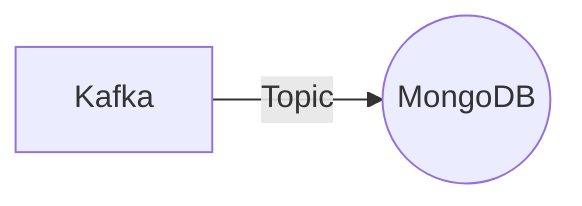

# Connect Kafka to MongoDB

Quix helps you integrate Kafka to MongoDB using pure Python.

## MongoDB

MongoDB is a widely-used, open-source, document-oriented NoSQL database technology. It is designed to store data in a flexible, JSON-like format, making it easy to work with for developers. MongoDB uses a system of collections and documents, allowing for fast and efficient data retrieval and manipulation. It also provides features such as automatic sharding for scalability, replication for high availability, and a powerful query language for advanced data analysis. With its ability to handle large volumes of data and its flexibility in data modeling, MongoDB is a popular choice for modern web applications and big data projects.

## Integrations

Quix is a good fit for integrating with MongoDB because of its robust real-time data processing capabilities and scalability. MongoDB is a popular NoSQL database that is known for its flexibility and scalability, making it well-suited for handling large volumes of real-time data. By integrating with Quix, users can easily develop and deploy real-time data pipelines that can ingest and process data from MongoDB in a streamlined and efficient manner.

Additionally, Quix Cloud's features such as enhanced collaboration, real-time monitoring, and flexible scaling make it ideal for working with MongoDB in a cloud-native environment. The platform's support for secure management of secrets and compliance with dedicated infrastructure options ensures that data stored in MongoDB is properly secured and compliant with regulatory requirements.

Furthermore, Quix Streams' Python interface and support for serialization formats and stateful operations make it easy to interact with MongoDB from a Python environment. The platform's integration with Kafka also provides a seamless way to stream data from MongoDB to other data sources or sinks.

In conclusion, Quix is a good fit for integrating with MongoDB due to its real-time data processing capabilities, scalability, and support for Python integration. By leveraging these features, users can efficiently work with MongoDB in a cloud-native environment and build reliable and scalable data pipelines for their applications.

