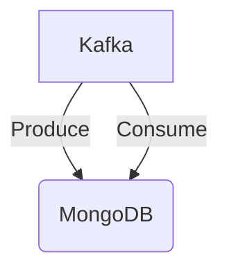

# Connect Kafka to MongoDB

Quix helps you integrate Kafka to MongoDB using pure Python.

<a class="md-button md-button--primary" href="https://share.hsforms.com/1iW0TmZzKQMChk0lxd_tGiw4yjw2?__hstc=175542013.2303933fbd746c0ac86d9ccbe9bc9100.1728383268831.1729603416735.1729620918855.31&__hssc=175542013.1.1729620918855&__hsfp=2132701734" target="_blank" style="margin-right:.5rem;">Book a demo</a>
 

## MongoDB

MongoDB is a popular open-source NoSQL database that is designed to store and manage vast amounts of data in a flexible and scalable manner. It uses a document-oriented data model, meaning that instead of storing data in tables with rows and columns like traditional relational databases, MongoDB stores data in JSON-like documents. This allows for greater flexibility in data structure and schema design, making it easier to adapt to changing data requirements. MongoDB also offers powerful features such as automatic sharding for horizontal scaling, high availability through replica sets, and a flexible query language that supports complex queries and aggregation operations. Overall, MongoDB is a versatile and efficient technology that is well-suited for handling the demands of modern applications that require fast and scalable data storage solutions.

## Integrations

Quix is a good fit for integrating with MongoDB because of its comprehensive platform designed for developing, deploying, and managing real-time data pipelines. MongoDB is a popular NoSQL database that is known for its flexibility, scalability, and real-time data processing capabilities. 

Quix Cloud's streamlined development and deployment features, such as integrated online code editors and CI/CD tools, make it easy to create and deploy data pipelines that interact with MongoDB. The platform's support for efficient collaboration, real-time monitoring, and flexible scaling also align well with MongoDB's capabilities and requirements.

Additionally, Quix's development tools, data exploration and visualization capabilities, and robust CI/CD processes can enhance the integration with MongoDB by providing seamless workflows for managing and analyzing data stored in the database. The platform's support for Kafka integration and dedicated infrastructure options further enhance its compatibility with MongoDB, as both technologies can work together to handle large volumes of real-time data effectively.

Furthermore, Quix Streams, a cloud-native library for processing data in Kafka using Python, can be utilized to interact with MongoDB in a more user-friendly and efficient manner. The library's integration with Python and support for serialization, state management, time window aggregations, and container orchestration make it a valuable tool for incorporating MongoDB into data pipelines developed with Quix. 

Overall, the features and capabilities of Quix make it a strong fit for integrating with MongoDB, enabling users to leverage the strengths of both technologies to build and manage advanced real-time data processing pipelines.

