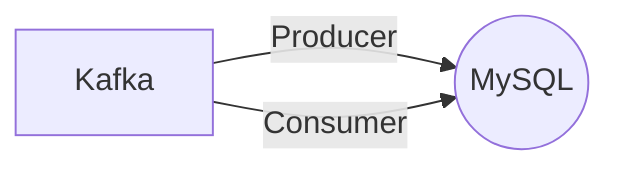

# Connect Kafka to MySQL

Quix helps you integrate Kafka to MySQL using pure Python.

## MySQL

MySQL is a widely-used open-source relational database management system that is based on Structured Query Language (SQL). It is known for its reliability, flexibility, and scalability, making it a popular choice for powering websites, applications, and other data-driven projects. MySQL allows users to efficiently store and manage large amounts of data, performing tasks such as data retrieval, insertion, and modification with ease. With its robust security features, high performance, and ease of use, MySQL has become a go-to solution for organizations looking to build and manage their databases effectively.

## Integrations

Quix is a good fit for integrating with MySQL because it offers a comprehensive platform for developing, deploying, and managing real-time data pipelines. The platform's streamlined development and deployment features, as well as enhanced collaboration tools, make it easier to integrate with MySQL databases and efficiently manage data pipelines.

Additionally, Quix Cloud's real-time monitoring capabilities enable users to monitor pipeline performance and critical metrics, which is essential for maintaining the integrity and efficiency of data pipelines connected to MySQL databases. The platform's flexible scaling and management options also allow for seamless resource allocation and management, which is crucial for optimizing performance when integrating with MySQL.

Furthermore, Quix Streams' Python interface and seamless integration with Python libraries make it easier to work with data stored in MySQL databases, as Python is a commonly used programming language for data manipulation and analysis. The platform's support for serialization formats, stateful operations, and time window aggregations also align well with the requirements of working with MySQL data.

Overall, the features and capabilities offered by Quix make it a suitable choice for integrating with MySQL databases and effectively managing real-time data pipelines.

