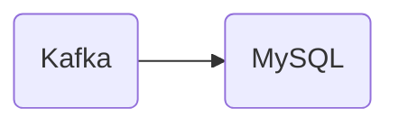

# Connect Kafka to MySQL

Quix helps you integrate Kafka to MySQL using pure Python.

<a class="md-button md-button--primary" href="https://share.hsforms.com/1iW0TmZzKQMChk0lxd_tGiw4yjw2?__hstc=175542013.2303933fbd746c0ac86d9ccbe9bc9100.1728383268831.1729603416735.1729620918855.31&__hssc=175542013.1.1729620918855&__hsfp=2132701734" target="_blank" style="margin-right:.5rem;">Book a demo</a>
 

## MySQL

MySQL is an open-source relational database management system that uses structured query language (SQL) to store, manage, and retrieve data. It is a popular choice for businesses and developers due to its scalability, high performance, and reliability. MySQL supports various platforms and operating systems, making it flexible and easy to integrate into existing systems. With features such as data security, replication, and clustering, MySQL is widely used in web applications, content management systems, e-commerce platforms, and many other types of software. Overall, MySQL is a powerful and versatile technology that helps organizations efficiently handle large volumes of data.

## Integrations

Quix is a good fit for integrating with MySQL because it offers a comprehensive platform for developing, deploying, and managing real-time data pipelines. MySQL is a popular relational database management system that is commonly used for storing and managing structured data. By integrating Quix with MySQL, users can leverage the streamlined development and deployment features of Quix Cloud to easily create and deploy data pipelines that interact with MySQL databases.

Additionally, Quix Cloud's enhanced collaboration capabilities can benefit teams working with MySQL databases by providing organization and permission management, increasing project visibility, and control. Real-time monitoring tools in Quix Cloud can be used to monitor the performance of data pipelines that interact with MySQL databases, allowing users to identify and address any issues quickly.

Furthermore, Quix Cloud's flexible scaling and management features can help users easily scale resources, manage CPU and memory, and handle multiple environments linked to Git branches when working with MySQL databases. The platform's security and compliance features ensure secure management of secrets and compliance with dedicated infrastructure options and SLAs when integrating with MySQL.

In addition, Quix Streams, a cloud-native library for processing data in Kafka using Python, also supports various serialization formats and stateful operations using RocksDB, which can be beneficial for users looking to integrate MySQL with Kafka for real-time data processing. This makes Quix a versatile and efficient tool for integrating with MySQL databases, offering a range of features that can streamline development, enhance collaboration, and provide real-time monitoring capabilities.

