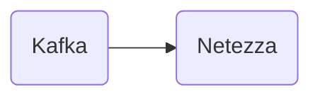

# Connect Kafka to Netezza

Quix helps you integrate Kafka to Netezza using pure Python.

- __Find out how we can help you integrate!__

    <a class="md-button md-button--primary" href="https://share.hsforms.com/1iW0TmZzKQMChk0lxd_tGiw4yjw2?__hstc=175542013.2303933fbd746c0ac86d9ccbe9bc9100.1728383268831.1729603416735.1729620918855.31&__hssc=175542013.1.1729620918855&__hsfp=2132701734" target="_blank" style="margin:.5rem;">Book a demo</a>

## Netezza

Netezza is a data warehousing appliance that is designed for high-performance analytics and complex querying. It utilizes a parallel processing architecture that allows for rapid data processing and real-time analytics. Netezza is known for its ease of use and scalability, making it a popular choice for companies handling large volumes of data. Its integrated hardware and software platform simplifies administration and maintenance, while its advanced features like data compression and in-database analytics make it a powerful tool for gaining insights from complex datasets. Overall, Netezza is a cutting-edge technology that offers businesses the ability to efficiently analyze and leverage their data for strategic decision-making.

## Integrations

Quix is a good fit for integrating with Netezza because of its comprehensive platform designed for developing, deploying, and managing real-time data pipelines. 

Firstly, Quix Cloud offers streamlined development and deployment tools that can simplify the creation and deployment of data pipelines, which can be beneficial for integrating with Netezza's data processing capabilities.

Secondly, the enhanced collaboration features of Quix Cloud can help teams efficiently work together on integrating Netezza with other systems or processes. The platform supports organization and permission management, increasing project visibility and control, which can be crucial for successful integration projects.

Quix Cloud also provides real-time monitoring and scaling capabilities, which can be essential for integrating with Netezza to ensure optimal performance and scalability. The platform offers tools for real-time logs, metrics, and data exploration, allowing users to monitor pipeline performance and critical metrics.

Moreover, Quix Cloud's robust CI/CD processes and support for various data sources and sinks can facilitate seamless integration with Netezza. The platform also offers dedicated infrastructure options for running pipelines, which can be useful for integrating with Netezza's dedicated solutions.

Additionally, Quix Streams, a cloud-native library for processing data in Kafka using Python, can be beneficial for integrating Netezza with Kafka solutions. The library combines Kafka's scalability with a user-friendly Python interface, making it easier to process data between Netezza and Kafka using Quix Streams.

Overall, Quix's features, including development tools, collaboration capabilities, real-time monitoring, and support for Kafka integration, make it a good fit for integrating with Netezza's technology for data processing and analytics.

