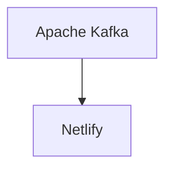

# Connect Kafka to Netlify

Quix helps you integrate Kafka to Netlify using pure Python.

## Netlify

Netlify is a modern web development platform that simplifies the process of deploying and hosting websites and web applications. It offers features such as continuous deployment, serverless functions, and global CDN distribution to ensure fast and reliable performance. With Netlify, developers can easily connect their code repositories, build and deploy their projects with a single click. It also provides features for team collaboration, version control, and automatic SSL certificate provisioning. Overall, Netlify is a powerful tool that streamlines the development and deployment process, making it easier for teams to create and launch websites and applications efficiently.

## Integrations

Quix is a good fit for integrating with the technology called Netlify because Netlify is a platform that simplifies the process of deploying and hosting websites and web applications. By integrating with Quix, developers can take advantage of their streamlined development and deployment features to quickly and efficiently create real-time data pipelines that power their websites and applications.

Additionally, the enhanced collaboration capabilities of Quix can help improve teamwork and communication among developers working on Netlify projects. The real-time monitoring and scaling capabilities provided by Quix can also ensure that the data pipelines powering the Netlify projects are running smoothly and efficiently, providing a seamless user experience for website visitors.

Furthermore, the security and compliance features of Quix can help ensure that sensitive data used in Netlify projects is handled securely and in accordance with industry regulations. The robust CI/CD processes supported by Quix can also streamline the deployment of updates to Netlify projects, making it easier for developers to iterate and improve their websites and applications.

Overall, by integrating Quix with Netlify, developers can leverage a comprehensive platform for developing, deploying, and managing real-time data pipelines to enhance the performance and scalability of their web projects.

