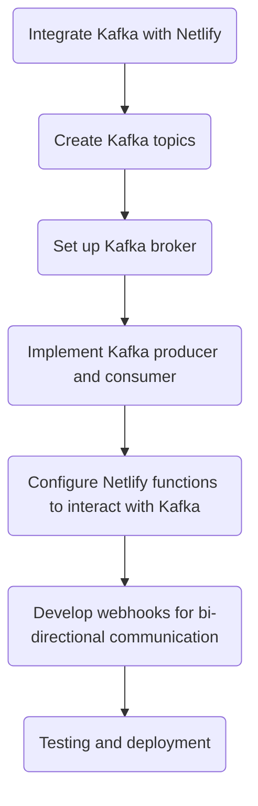

# Connect Kafka to Netlify

Quix helps you integrate Kafka to Netlify using pure Python.

<a class="md-button md-button--primary" href="https://share.hsforms.com/1iW0TmZzKQMChk0lxd_tGiw4yjw2?__hstc=175542013.2303933fbd746c0ac86d9ccbe9bc9100.1728383268831.1729603416735.1729620918855.31&__hssc=175542013.1.1729620918855&__hsfp=2132701734" target="_blank" style="margin-right:.5rem;">Book a demo</a>
 

## Netlify

Netlify is a modern web development platform that simplifies the process of deploying, automating, and managing websites and applications. It provides a cloud-based hosting service that allows developers to easily deploy their projects with just a few clicks, eliminating the need for complex server configurations or manual updates. Netlify also offers features like continuous integration and automatic SSL certificate provisioning, ensuring that websites are always secure and up to date. With its intuitive interface and robust set of tools, Netlify is a valuable tool for developers looking to streamline their workflow and focus on building great web experiences.

## Integrations

Quix is a good fit for integrating with Netlify because it offers a comprehensive platform for developing, deploying, and managing real-time data pipelines. 

1. Streamlined Development and Deployment: Quix Cloud simplifies the creation and deployment of data pipelines with integrated online code editors and CI/CD tools. This aligns well with Netlify's focus on streamlining the development and deployment process.

2. Enhanced Collaboration: Quix Cloud supports efficient collaboration with organization and permission management, increasing project visibility and control. This aligns with Netlify's emphasis on enhancing collaboration and teamwork within development teams.

3. Real-Time Monitoring: Quix Cloud provides tools for real-time logs, metrics, and data exploration, allowing users to monitor pipeline performance and critical metrics. This real-time monitoring capability is essential for ensuring optimal performance and reliability, which aligns with Netlify's focus on providing real-time feedback and monitoring.

4. Flexible Scaling and Management: Quix Cloud enables users to easily scale resources, manage CPU and memory, and handle multiple environments linked to Git branches. This flexibility in scaling and management aligns well with Netlify's focus on providing scalable and flexible solutions for developers.

5. Security and Compliance: Quix Cloud ensures secure management of secrets and compliance with dedicated infrastructure options and SLAs. This commitment to security and compliance aligns with Netlify's emphasis on providing secure and compliance-ready solutions for development teams.

Overall, Quix's features and capabilities make it a good fit for integrating with Netlify as they both focus on streamlining development, enhancing collaboration, providing real-time monitoring, and offering flexible scaling and management options.

