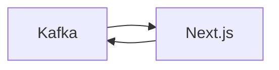

# Connect Kafka to Next.js

Quix helps you integrate Kafka to Next.js using pure Python.

## Next.js

Next.js is a popular open-source JavaScript framework that allows developers to build fast and efficient web applications. It is built on top of React, making it easy to create dynamic and interactive user interfaces. One of the key features of Next.js is server-side rendering, which helps improve performance and SEO by generating HTML pages on the server and sending them to the client. Next.js also supports static site generation and incremental static regeneration, allowing developers to pre-render pages at build time and update them as needed. With features like automatic code splitting, hot module replacement, and built-in CSS support, Next.js provides a seamless development experience for building modern web applications.

## Integrations

Quix is a good fit for integrating with the technology called Next.js because it offers a comprehensive platform for developing, deploying, and managing real-time data pipelines. 

Next.js is a popular framework for building dynamic web applications with React. By integrating Next.js with Quix, developers can leverage the streamlined development and deployment features of the platform, including integrated online code editors and CI/CD tools. This simplifies the creation and deployment of data pipelines, making it easier to build and scale web applications that rely on real-time data processing.

Additionally, the enhanced collaboration capabilities of Quix Cloud, such as organization and permission management, can help teams working with Next.js to improve project visibility and control. Real-time monitoring tools provided by Quix Cloud also enable developers to easily monitor pipeline performance and critical metrics, ensuring that their Next.js applications are running smoothly.

Furthermore, Quix Cloud's flexible scaling and management features allow users to easily scale resources and manage CPU and memory, which can be beneficial for Next.js applications that require scalability and performance optimization. The platform's security and compliance measures also ensure that sensitive data is securely managed, which is important for applications built with Next.js that may handle sensitive information.

Overall, the robust development tools, data exploration and visualization capabilities, and Kafka integration offered by Quix Cloud make it a well-suited platform for integrating with Next.js and building dynamic web applications that rely on real-time data processing.

