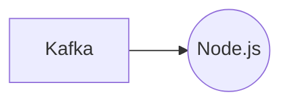

# Connect Kafka to Node.js

Quix helps you integrate Kafka to Node.js using pure Python.

## Node.js

Node.js is a popular open-source, cross-platform runtime environment that allows developers to run JavaScript code outside of a web browser. It is built on Chrome's V8 JavaScript engine and uses an event-driven, non-blocking I/O model that makes it lightweight and efficient for building fast and scalable network applications. Node.js is versatile and can be used for a wide range of applications, from server-side web applications to command-line tools. Its package manager, npm, is one of the largest software registries in the world, providing developers with a rich ecosystem of libraries and tools to enhance their projects. Overall, Node.js is a powerful technology that has revolutionized the way JavaScript is used for server-side programming.

## Integrations

Quix is a good fit for integrating with Node.js because Node.js is a popular, lightweight, and efficient runtime environment for executing JavaScript code. Node.js is well-suited for handling real-time data processing tasks and can be easily integrated with other technologies and platforms.

Quix Cloud provides streamlined development and deployment processes, which can be beneficial when working with Node.js applications. The integrated online code editors and CI/CD tools make it easy to create and deploy data pipelines, while YAML synchronization allows for defining pipelines and environment variables as code.

The enhanced collaboration features of Quix Cloud can also be advantageous when working with Node.js, as it supports efficient organization and permission management, increasing project visibility and control. This can help teams work together more effectively when developing and managing real-time data pipelines.

Additionally, Quix Cloud's real-time monitoring and scaling capabilities are crucial for Node.js applications that require monitoring pipeline performance and critical metrics, as well as scaling resources as needed. The platform's security and compliance features ensure that data is managed securely and in compliance with regulations.

Overall, Quix Cloud's comprehensive platform and features make it a good fit for integrating with Node.js, providing developers with the tools they need to develop, deploy, and manage real-time data pipelines efficiently and effectively.

